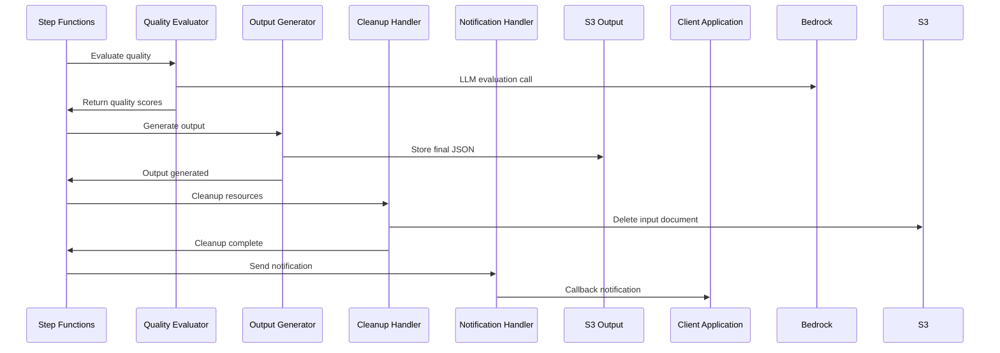

# Low Level Design Document

## Overview

The Intelligent Document Processing (IDP) system is a cloud-native solution built on AWS infrastructure that processes PII documents through automated classification and extraction workflows. The system replaces the existing Snowflake Cortex solution with a more accurate, performant, and cost-effective AWS-based architecture.

### Key Design Principles

- **Event-Driven Architecture**: Leverages AWS EventBridge for loose coupling and scalability
- **Serverless-First**: Uses Lambda functions and Step Functions for cost optimization
- **Configuration-Driven**: Supports dynamic parameter changes without code deployment
- **Security by Design**: Implements comprehensive security controls and data protection
- **Observability**: Built-in monitoring, logging, and alerting capabilities

### Business Benefits

- **Improved Accuracy**: Target >95% classification accuracy and >90% field extraction accuracy
- **Reduced Manual Intervention**: Decrease manual review cases from 50% to <15%
- **Cost Optimization**: Serverless architecture reduces operational costs by 40-60%
- **Scalability**: Automatic scaling to handle 100-500 documents per minute
- **Extensibility**: Easy addition of new document types without code changes

## Architecture

### High-Level System Architecture

```mermaid
graph TB
    subgraph "Client Layer"
        CA[Client Applications]
        OnPrem[On-Premises Apps]
    end
    
    subgraph "API & Upload Layer"
        DC[Direct Connect/PrivateLink]
        APIG[API Gateway]
        S3Input[S3 Input Bucket]
    end
    
    subgraph "Processing Layer"
        EB[EventBridge]
        SF[Step Functions]
        INIT[INIT/Correlate]
        VAL[Document Validator]
        BDA[BDA Processor]
        EVAL[Quality Evaluator]
        OUT[Output Generator]
        CLEAN[Cleanup Handler]
        NOTIFY[Notification Handler]
        ERR[Error Handler]
        BEDROCK[AWS Bedrock]
    end
    
    subgraph "Storage Layer"
        DDB[DynamoDB]
        S3Config[S3 Config Bucket]
        S3Output[S3 Output Bucket]
        SM[Secrets Manager]
    end
    
    subgraph "Monitoring Layer"
        CW[CloudWatch]
        NR[New Relic]
        SNS[SNS Alerts]
    end
    
    CA --> DC
    OnPrem --> DC
    DC --> APIG
    APIG --> S3Input
    APIG --> DDB
    S3Input --> EB
    EB --> SF
    SF --> INIT
    INIT --> VAL
    VAL --> BDA
    BDA --> EVAL
    EVAL --> OUT
    OUT --> CLEAN
    CLEAN --> NOTIFY
    SF --> ERR
    BDA --> BEDROCK
    EVAL --> BEDROCK
    SF --> DDB
    SF --> S3Config
    SF --> S3Output
    SF --> CW
    CW --> NR
    CW --> SNS
    SF --> SM
```### 
Network Architecture

**Serverless-First Approach**: 
- **No VPC Required**: Lambda functions run in AWS-managed secure environment
- **API Gateway**: Public endpoint with comprehensive security controls
- **Service Integration**: Direct AWS service communication via secure backbone
- **Cost Benefits**: No NAT Gateway or VPC endpoint fees
- **Performance**: Faster cold start times and automatic scaling

## System Components

### 1. Document Upload and API Layer

**API Gateway Component**
- **Purpose**: Secure entry point for document uploads and status checking
- **Key Endpoints**:
  - `POST /upload` - Generate pre-signed URLs for secure document upload
  - `GET /status/{documentId}` - Check processing status and results
  - `POST /callback` - Receive processing completion notifications

**Security Features**:
- API Key authentication for client applications
- Rate limiting: 100 requests per minute per client
- HTTPS enforcement for all communications
- Comprehensive audit logging

### 2. Document Processing Pipeline

**Step Functions Orchestration**
The system uses AWS Step Functions to orchestrate 8 Lambda functions in a sequential workflow:

1. **INIT/Correlate Lambda**: Initializes processing context and generates correlation IDs
2. **Document Validator Lambda**: Validates file format, size, and accessibility
3. **BDA Processor Lambda**: Handles Bedrock Data Automation for classification and extraction
4. **Quality Evaluator Lambda**: Performs LLM-based quality assessment
5. **Output Generator Lambda**: Creates structured JSON output
6. **Cleanup Handler Lambda**: Manages document lifecycle and cleanup
7. **Notification Handler Lambda**: Sends completion notifications to clients
8. **Error Handler Lambda**: Processes errors and manages retry logic

**Processing Flow**:
```mermaid
graph LR
    A[Document Upload] --> B[INIT/Correlate]
    B --> C[Validate Document]
    C --> D[BDA Processing]
    D --> E{Confidence Check}
    E -->|≥85%| F[Quality Evaluation]
    E -->|<85%| G[Manual Review Queue]
    F --> H[Generate Output]
    H --> I[Cleanup Resources]
    I --> J[Send Notification]
    G --> K[Manual Review Process]
```### 
3. Bedrock Data Automation (BDA) Integration

**Core AI Processing Engine**
- **Technology**: AWS Bedrock Data Automation with custom blueprints
- **Capabilities**: 
  - Language detection with 95%+ accuracy
  - Document classification across all supported types
  - Field extraction with configurable schemas
  - Confidence scoring for all operations

**Supported Document Types**:
- **ID Documents**: National ID, Driver's License, Passport, Residence Permit, Citizenship Card
- **Proof of Address**: Utility bills, Bank Statements, Lease agreements, Council tax bills
- **Source of Funds**: Payslips, Bank Statements, Tax Declarations
- **Legal Claims**: Court documents across UK, Malta, Sweden, Spain, Germany jurisdictions

### 4. Configuration Management System

**Dynamic Configuration**
- **Storage**: S3-based configuration with versioning
- **Structure**: Document-type specific parameters and global settings
- **Deployment**: Automated configuration updates via CI/CD pipeline
- **Rollback**: Automatic rollback on validation failures

**Configuration Parameters**:
- Classification confidence thresholds per document type
- Field extraction schemas (required and optional fields)
- LLM model selection for different processing tasks
- Language hints and processing timeouts
- Quality evaluation criteria

### 5. Quality Assurance and Evaluation

**Automated Quality Assessment**
- **LLM Evaluation**: Uses Claude Haiku for automated quality scoring
- **Metrics Tracked**:
  - Classification accuracy (target: ≥95%)
  - Field-level precision and recall (target: ≥90%)
  - Confidence threshold compliance
  - Processing time and throughput

**Quality Gates**:
- Minimum 85% confidence for automatic processing
- Documents below threshold routed to manual review
- Comprehensive error handling and retry mechanisms
- Dead letter queue for failed processing items## Da
ta Models and Storage

### Document Metadata Model
```json
{
  "document_id": "uuid",
  "correlation_id": "correlation-uuid",
  "upload_timestamp": "iso8601",
  "client_id": "string",
  "document_type": "string",
  "file_format": "pdf|jpg|jpeg|tiff",
  "file_size_bytes": "integer",
  "callback_url": "string",
  "processing_status": "uploaded|processing|completed|failed|manual_review",
  "language_detected": "string",
  "language_confidence": "float",
  "classification_result": {
    "document_type": "string",
    "confidence_score": "float",
    "classification_timestamp": "iso8601"
  },
  "extraction_result": {
    "extracted_fields": "object",
    "confidence_scores": "object",
    "extraction_timestamp": "iso8601"
  },
  "evaluation_result": {
    "quality_score": "float",
    "accuracy_metrics": "object",
    "evaluation_timestamp": "iso8601"
  },
  "enriched_context": {
    "client_config": "object",
    "routing_rules": "object"
  }
}
```

### Processing Result Output
```json
{
  "document_id": "uuid",
  "processing_metadata": {
    "processed_at": "iso8601",
    "processing_duration_total_ms": "integer",
    "system_version": "string"
  },
  "document_classification": {
    "type": "string",
    "confidence": "float",
    "language": "string"
  },
  "extracted_data": {
    "field_name": "field_value"
  },
  "confidence_scores": {
    "field_name": "confidence_float"
  },
  "quality_assessment": {
    "overall_score": "float",
    "meets_threshold": "boolean",
    "manual_review_required": "boolean"
  }
}
```#
# Error Handling and Resilience

### Error Categories and Responses

**Upload Errors**
- Invalid file format: Return 400 with supported formats list
- File size exceeded: Return 413 with size limits
- Authentication failure: Return 401 with error details

**Processing Errors**
- BDA API failure: Automatic retry with exponential backoff
- Classification below threshold: Route to manual review queue
- Processing timeout: Increase timeout and retry once
- Configuration error: Use fallback configuration and alert administrators

**Resilience Patterns**
- **Circuit Breaker**: 50% failure rate triggers circuit open for 2 minutes
- **Retry Logic**: 3 attempts with exponential backoff for transient failures
- **Dead Letter Queue**: Failed items after max retries for investigation
- **Health Checks**: Synthetic document processing tests for system validation

## Security and Compliance

### Data Protection
- **Encryption**: All data encrypted at rest (S3, DynamoDB) and in transit (HTTPS/TLS)
- **Access Control**: IAM roles with least privilege principle
- **Data Lifecycle**: Automatic document deletion after successful processing
- **Audit Logging**: Comprehensive logging for compliance and troubleshooting

### Network Security
- **API Security**: API Gateway with authentication, rate limiting, and CORS
- **Service Communication**: Secure AWS backbone for service-to-service communication
- **Secrets Management**: AWS Secrets Manager for secure credential storage
- **Monitoring**: Real-time security monitoring and alerting

## Performance and Scalability

### Performance Targets
- **Processing Time**: ≤30 seconds per document (average)
- **Throughput**: 100 documents/minute (normal), 500 documents/minute (peak)
- **Availability**: 99.9% uptime with automatic failover
- **Accuracy**: ≥95% classification, ≥90% field extraction

### Scalability Features
- **Automatic Scaling**: Lambda functions scale automatically based on demand
- **Concurrent Processing**: Multiple documents processed simultaneously
- **Resource Optimization**: Memory and timeout settings optimized per function
- **Cost Efficiency**: Pay-per-use model with no idle resource costs## Mo
nitoring and Observability

### Monitoring Strategy
- **CloudWatch Integration**: Native AWS monitoring for all services
- **New Relic Integration**: Advanced observability and performance monitoring
- **Custom Metrics**: Business-specific metrics for document processing
- **Real-time Dashboards**: Processing status, quality metrics, and error analysis

### Alerting Configuration
- **Critical Alerts**: Processing failure rate >5%, DLQ messages >0
- **Warning Alerts**: Manual review queue depth >10, processing time >60s
- **Business Metrics**: Classification accuracy drops, throughput anomalies
- **Notification Channels**: Email, Slack, and SMS for different severity levels

## Testing and Quality Assurance

### Testing Strategy
- **Synthetic Data Testing**: Controlled test data for all document types
- **LLM-Driven Evaluation**: Automated quality assessment using AI
- **Performance Testing**: Load testing up to 500 documents/minute
- **Integration Testing**: End-to-end workflow validation

### Quality Thresholds
- Overall quality score ≥0.85
- Classification accuracy ≥0.95
- Field-level precision ≥0.90
- Field-level recall ≥0.85

## Application Flow Diagrams

### Document Upload Flow
```mermaid
sequenceDiagram
    participant Client as Client Application
    participant API as API Gateway
    participant Lambda as Upload Lambda
    participant S3 as S3 Input Bucket
    participant DDB as DynamoDB
    participant EB as EventBridge
    participant SF as Step Functions
    
    Client->>API: POST /upload (metadata)
    API->>Lambda: Invoke upload handler
    Lambda->>DDB: Store document metadata
    Lambda->>S3: Generate pre-signed URL
    Lambda->>API: Return pre-signed URL
    API->>Client: Return upload URL
    Client->>S3: Upload document using pre-signed URL
    S3->>EB: Trigger Object Created event
    EB->>SF: Start workflow execution
```### BDA P
rocessing Flow
```mermaid
sequenceDiagram
    participant SF as Step Functions
    participant INIT as INIT/Correlate
    participant VAL as Document Validator
    participant BDA as BDA Processor
    participant Bedrock as AWS Bedrock
    participant Config as Config S3
    participant DDB as DynamoDB
    
    SF->>INIT: Initialize processing context
    INIT->>DDB: Generate correlation ID and enrich context
    INIT->>SF: Return enriched context
    SF->>VAL: Validate document
    VAL->>S3: Check file format/size
    VAL->>DDB: Update status: validating
    VAL->>SF: Return validation result
    SF->>BDA: Process with BDA
    BDA->>Config: Load configuration/blueprints
    BDA->>Bedrock: Call BDA API
    Bedrock->>BDA: Return processing results
    BDA->>DDB: Update processing results
    BDA->>SF: Return BDA results
```

### Quality Evaluation and Output Flow


## Configuration Management

### BDA Blueprint Structure
- **Document Types**: National ID, Driver's License, Passport, Utility Bills, Bank Statements, Legal Claims
- **Processing Models**: Claude Sonnet for classification/extraction, Haiku for evaluation
- **Configuration Management**: Dynamic blueprint loading from S3
- **Quality Thresholds**: Configurable confidence scores per document type

### Configuration Parameters Example
```json
{
  "document_types": {
    "national_id": {
      "classification_threshold": 0.85,
      "extraction_schema": {
        "required_fields": ["full_name", "document_number", "expiry_date"],
        "optional_fields": ["address", "date_of_birth"]
      },
      "llm_model": "anthropic.claude-3-sonnet-20240229-v1:0",
      "language_hints": ["en", "de", "fr"],
      "complexity_level": "medium"
    }
  },
  "global_settings": {
    "max_processing_time": 300,
    "retry_attempts": 3,
    "output_format": "json"
  }
}
```

This comprehensive Low Level Design provides a business-focused overview of the IDP system architecture, emphasizing business benefits, system capabilities, and operational characteristics suitable for stakeholder review and approval.