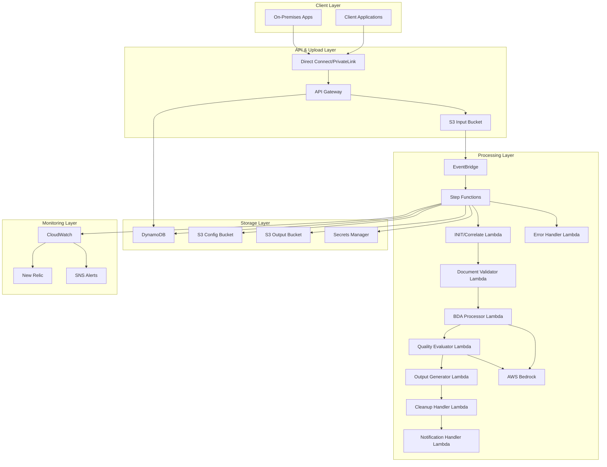
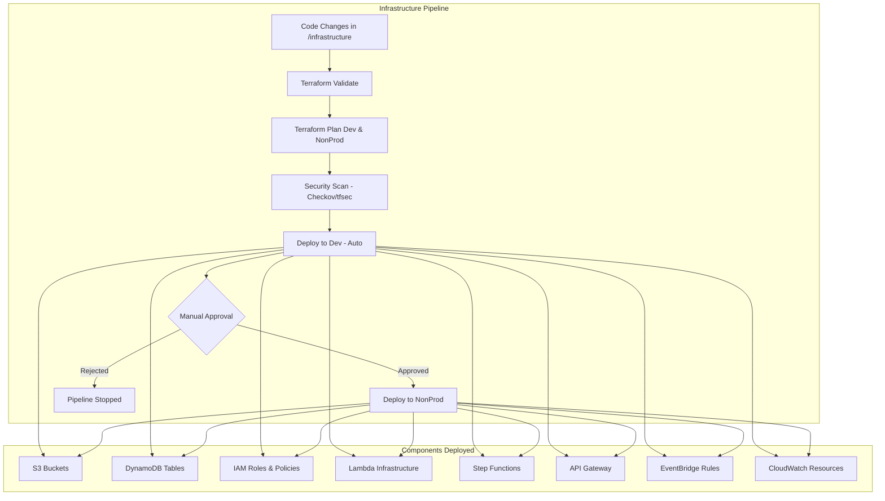
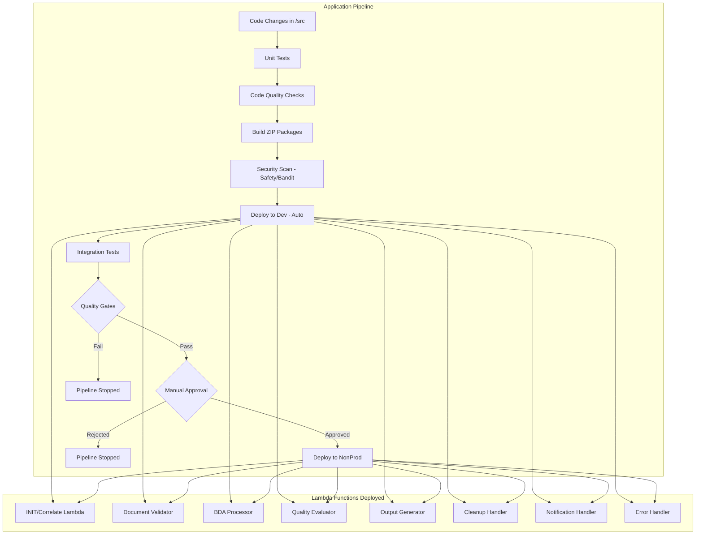
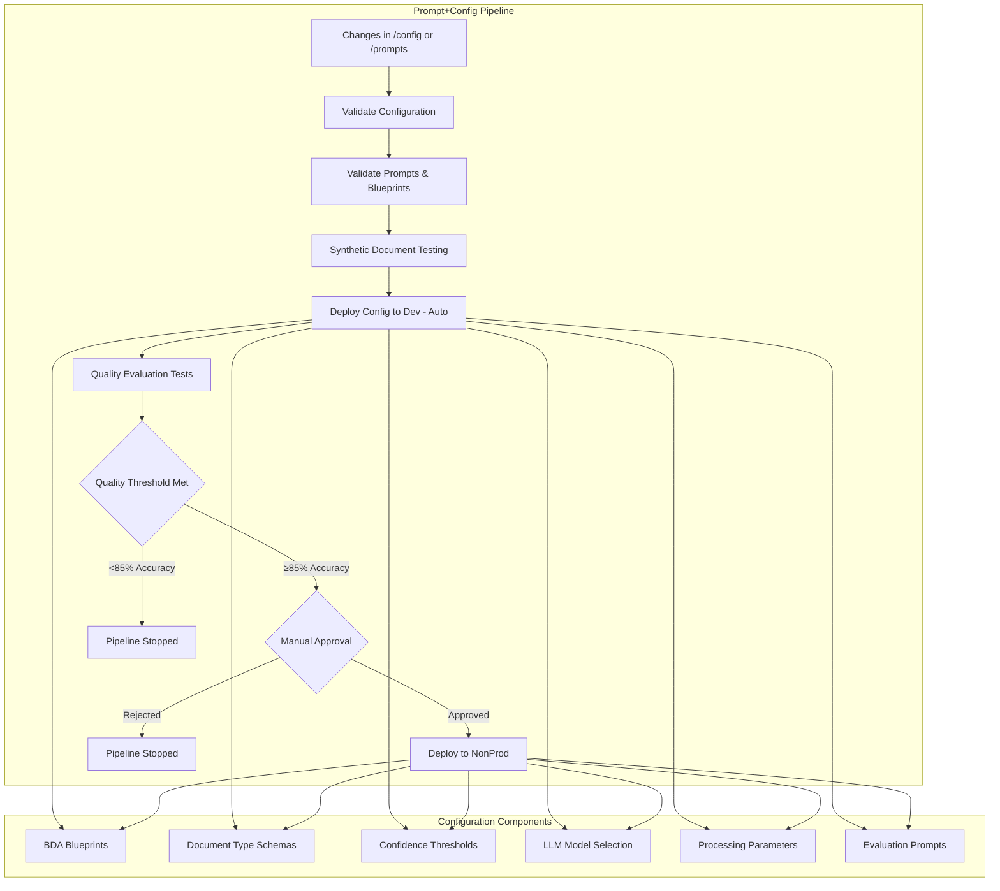

# Low Level Design Document

## Overview

The Intelligent Document Processing (IDP) system is a cloud-native solution built on AWS infrastructure that processes PII documents through automated classification and extraction workflows. The system replaces the existing Snowflake Cortex solution with a more accurate, performant, and cost-effective AWS-based architecture.

### Key Design Principles

- **Event-Driven Architecture**: Leverages AWS EventBridge for loose coupling and scalability
- **Serverless-First**: Uses Lambda functions and Step Functions for cost optimization
- **Configuration-Driven**: Supports dynamic parameter changes without code deployment
- **Security by Design**: Implements comprehensive security controls and data protection
- **Observability**: Built-in monitoring, logging, and alerting capabilities

## Architecture

### High-Level Architecture Components



### Network Architecture

**Serverless-First Approach**: 
- **No VPC Required**: Lambda functions run in AWS-managed VPC by default
- **VPC Endpoints**: Optional for enhanced security and cost optimization
- **API Gateway**: Public endpoint with security controls (API keys, rate limiting)
- **Service-to-Service**: Direct AWS service integration without custom networking

**When VPC Might Be Needed**:
- Integration with on-premises databases (not applicable here)
- Custom network security requirements beyond AWS defaults
- Compliance requirements for network isolation

**Current Design Benefits**:
- Reduced complexity and management overhead
- Lower costs (no NAT Gateway, VPC endpoints fees)
- Faster cold start times for Lambda functions
- Automatic scaling without network constraints##
 Components and Interfaces

### 1. API Gateway Component

**Purpose**: Secure entry point for document uploads and metadata management

**Key Interfaces**:
- `POST /upload` - Generate pre-signed URLs for document upload
- `GET /status/{documentId}` - Check processing status
- `POST /callback` - Receive processing completion notifications

**Implementation Details**:
```json
{
  "upload_endpoint": {
    "method": "POST",
    "path": "/upload",
    "request_body": {
      "document_type": "string",
      "callback_url": "string",
      "metadata": "object"
    },
    "response": {
      "document_id": "string",
      "presigned_url": "string",
      "expires_at": "timestamp"
    }
  }
}
```

**Security Controls**:
- API Key authentication for client applications
- Rate limiting: 100 requests per minute per client
- Request/response logging for audit trails
- CORS configuration for web-based clients

### 2. Document Processing Engine

**Purpose**: Core component for document classification and extraction

**Sub-Components**:

#### 2.1 Language Detection Service
- **Technology**: Bedrock Data Automation with language detection blueprints
- **Input**: Raw document uploaded to S3
- **Output**: Language code with confidence score via BDA
- **Threshold**: Minimum 95% confidence for language detection

#### 2.2 Document Classification Service
- **Technology**: Bedrock Data Automation with classification blueprints
- **Input**: Document and detected language from BDA
- **Output**: Document type classification with confidence score
- **Supported Types**: ID, POA, SOF, PH/ID, MFT, Legal Claims

#### 2.3 Field Extraction Service
- **Technology**: Bedrock Data Automation with extraction blueprints and schemas
- **Input**: Classified document and extraction schema
- **Output**: Structured JSON with extracted fields and confidence scores
- **Schema Management**: BDA blueprints contain predefined schemas for each document type

### 3. Configuration Management System

**Purpose**: Dynamic configuration for document processing parameters

**Configuration Structure**:
```json
{
  "document_types": {
    "national_id": {
      "classification_threshold": 0.85,
      "extraction_schema": {
        "required_fields": ["full_name", "document_number", "expiry_date"],
        "optional_fields": ["address", "date_of_birth"]
      },
      "llm_model": "anthropic.claude-3-sonnet-20240229-v1:0",
      "language_hints": ["en", "de", "fr"],
      "complexity_level": "medium"
    }
  },
  "global_settings": {
    "max_processing_time": 300,
    "retry_attempts": 3,
    "output_format": "json"
  }
}
```

**Configuration Deployment**:
- Stored in S3 with versioning enabled
- Lambda function validates configuration changes
- Automatic rollback on validation failures
- Configuration change triggers pipeline deployment

### 4. Step Functions Workflow

**Purpose**: Orchestrate document processing pipeline with comprehensive error handling and monitoring

#### Step Functions Workflow States

**Processing Flow**:
1. **INIT/Correlate** - Initialize processing context and generate correlation IDs
2. **Document Validation** - Verify file format, size, and accessibility
3. **BDA Processing** - Single call to Bedrock Data Automation for complete document processing
4. **Confidence Check** - Evaluate if results meet quality thresholds
5. **Quality Evaluation** - LLM-based assessment of extraction accuracy
6. **Output Generation** - Create structured JSON output
7. **Resource Cleanup** - Remove temporary files and update status
8. **Notification** - Inform client application of completion

**Error Handling**:
- **Automatic Retry** - 3 attempts with exponential backoff for transient failures
- **Manual Review Queue** - Low confidence results routed for human review
- **Dead Letter Queue** - Failed processing items for investigation
- **Error Notifications** - Client applications notified of processing failures

**Quality Gates**:
- **Confidence Threshold** - Minimum 85% confidence for automatic processing
- **Format Validation** - Only PDF, JPG, JPEG, TIFF files accepted
- **Size Limits** - Maximum 10MB file size
- **Processing Timeout** - 5-minute maximum processing time

### 5. Evaluation Engine

**Purpose**: Automated quality assessment using LLM evaluation

**Evaluation Metrics**:
- **Classification Accuracy**: Percentage of correctly classified documents
- **Field Precision**: Accuracy of extracted field values
- **Field Recall**: Completeness of required field extraction
- **Confidence Threshold Compliance**: Adherence to minimum confidence scores

**LLM Evaluation Prompt Template**:
```
Evaluate the following document extraction results:

Ground Truth: {ground_truth_json}
Extracted Data: {extracted_json}
Document Type: {document_type}

Provide evaluation scores for:
1. Classification accuracy (0-1)
2. Field-level precision (0-1)
3. Field-level recall (0-1)
4. Overall quality score (0-1)

Return results in JSON format with detailed explanations.
```## D
ata Models

### 1. Document Metadata Model

```json
{
  "document_id": "uuid",
  "upload_timestamp": "iso8601",
  "client_id": "string",
  "document_type": "string",
  "file_format": "pdf|jpg|jpeg|tiff",
  "file_size_bytes": "integer",
  "callback_url": "string",
  "processing_status": "uploaded|processing|completed|failed",
  "language_detected": "string",
  "language_confidence": "float",
  "classification_result": {
    "document_type": "string",
    "confidence_score": "float",
    "classification_timestamp": "iso8601"
  },
  "extraction_result": {
    "extracted_fields": "object",
    "confidence_scores": "object",
    "extraction_timestamp": "iso8601"
  },
  "evaluation_result": {
    "quality_score": "float",
    "accuracy_metrics": "object",
    "evaluation_timestamp": "iso8601"
  }
}
```

### 2. Configuration Schema Model

```json
{
  "version": "string",
  "last_updated": "iso8601",
  "document_types": {
    "{document_type}": {
      "classification_threshold": "float",
      "extraction_schema": {
        "required_fields": ["array"],
        "optional_fields": ["array"],
        "field_validations": "object"
      },
      "llm_model": "string",
      "language_hints": ["array"],
      "complexity_level": "low|medium|high",
      "processing_timeout": "integer"
    }
  },
  "global_settings": {
    "max_file_size_mb": "integer",
    "supported_formats": ["array"],
    "retention_days": "integer"
  }
}
```

### 3. Processing Result Model

```json
{
  "document_id": "uuid",
  "processing_id": "uuid",
  "status": "success|failure|partial",
  "processing_duration_ms": "integer",
  "extracted_data": {
    "document_type": "string",
    "language": "string",
    "fields": {
      "{field_name}": {
        "value": "any",
        "confidence": "float",
        "extraction_method": "string"
      }
    }
  },
  "quality_metrics": {
    "overall_score": "float",
    "field_accuracy": "object",
    "confidence_distribution": "object"
  },
  "errors": ["array"],
  "warnings": ["array"]
}
```

## Error Handling

### Error Categories and Responses

1. **Upload Errors**
   - Invalid file format: Return 400 with supported formats
   - File size exceeded: Return 413 with size limits
   - Authentication failure: Return 401 with error details

2. **Processing Errors**
   - BDA API failure: Retry with exponential backoff
   - Classification below threshold: Route to manual review queue
   - Processing timeout: Increase timeout and retry once
   - Blueprint configuration error: Use fallback blueprint

3. **Configuration Errors**
   - Invalid schema: Rollback to previous version
   - Missing model: Use fallback model configuration
   - Validation failure: Block deployment and alert administrators

### Dead Letter Queue Strategy

- **Primary Queue**: Standard processing queue with 3 retry attempts
- **DLQ Configuration**: Messages moved after 3 failures
- **DLQ Processing**: Manual review process with admin notifications
- **Monitoring**: CloudWatch alarms for DLQ message count

### Circuit Breaker Pattern

- **Failure Threshold**: 50% failure rate over 5 minutes
- **Circuit Open Duration**: 2 minutes
- **Health Check**: Synthetic document processing test
- **Recovery**: Gradual traffic increase after circuit closes## 
GitLab CI/CD Pipeline Strategy

### Pipeline Architecture Overview

The CI/CD strategy implements three separate pipelines to enable independent deployment cycles and reduce blast radius of changes:

1. **Infrastructure Pipeline** - Manages AWS resources and networking
2. **Application Pipeline** - Handles Lambda functions and application code
3. **Prompt+Config Pipeline** - Manages BDA blueprints and configuration

### 1. Infrastructure Pipeline

**Purpose**: Deploy and manage AWS infrastructure using Terraform

**Trigger Conditions**:
- Changes to `infrastructure/` directory
- Changes to `*.tf` files
- Manual pipeline execution
- Scheduled weekly validation runs

**Pipeline Stages**:

```yaml
# .gitlab-ci.yml (Infrastructure)
stages:
  - validate
  - plan
  - security-scan
  - deploy-dev
  - deploy-nonprod

variables:
  TF_ROOT: infrastructure/
  TF_VERSION: "1.6.0"

terraform-validate:
  stage: validate
  image: hashicorp/terraform:$TF_VERSION
  script:
    - cd $TF_ROOT
    - terraform init -backend=false
    - terraform validate
    - terraform fmt -check
  rules:
    - changes:
        - infrastructure/**/*
        - "*.tf"

terraform-plan-dev:
  stage: plan
  image: hashicorp/terraform:$TF_VERSION
  script:
    - cd $TF_ROOT
    - terraform init
    - terraform plan -var-file="environments/dev.tfvars" -out=dev.tfplan
  artifacts:
    paths:
      - $TF_ROOT/dev.tfplan
    expire_in: 1 hour
  environment:
    name: dev
  rules:
    - changes:
        - infrastructure/**/*

terraform-plan-nonprod:
  stage: plan
  image: hashicorp/terraform:$TF_VERSION
  script:
    - cd $TF_ROOT
    - terraform init
    - terraform plan -var-file="environments/nonprod.tfvars" -out=nonprod.tfplan
  artifacts:
    paths:
      - $TF_ROOT/nonprod.tfplan
    expire_in: 1 hour
  environment:
    name: nonprod
  rules:
    - changes:
        - infrastructure/**/*

security-scan:
  stage: security-scan
  image: bridgecrew/checkov:latest
  script:
    - checkov -d infrastructure/ --framework terraform
    - tfsec infrastructure/
  allow_failure: false

deploy-dev:
  stage: deploy-dev
  image: hashicorp/terraform:$TF_VERSION
  script:
    - cd $TF_ROOT
    - terraform init
    - terraform apply -auto-approve dev.tfplan
  environment:
    name: dev
    url: https://dev-idp.evoke.com
  dependencies:
    - terraform-plan-dev
    - security-scan

deploy-nonprod:
  stage: deploy-nonprod
  image: hashicorp/terraform:$TF_VERSION
  script:
    - cd $TF_ROOT
    - terraform init
    - terraform apply -auto-approve nonprod.tfplan
  environment:
    name: nonprod
    url: https://nonprod-idp.evoke.com
  when: manual
  dependencies:
    - deploy-dev
    - terraform-plan-nonprod
    - security-scan
```

**Infrastructure Components Managed**:
- API Gateway with security policies and rate limiting
- Lambda functions with appropriate IAM roles
- S3 buckets with versioning and encryption
- DynamoDB tables with backup configuration
- IAM roles and policies with least privilege
- EventBridge rules and targets
- Step Functions state machines
- CloudWatch log groups and alarms
- New Relic integration resources
- Secrets Manager for secure credential storage

### 2. Application Pipeline

**Purpose**: Build, test, and deploy Lambda function code and container images

**Trigger Conditions**:
- Changes to `src/` directory
- Changes to `requirements.txt` or `package.json`
- Changes to Dockerfile
- Manual pipeline execution

**Pipeline Stages**:

```yaml
# .gitlab-ci.yml (Application)
stages:
  - test
  - build
  - security-scan
  - deploy-dev
  - integration-test
  - deploy-nonprod

variables:
  PYTHON_VERSION: "3.11"
  AWS_DEFAULT_REGION: $AWS_REGION

unit-tests:
  stage: test
  image: python:$PYTHON_VERSION
  script:
    - pip install -r requirements-dev.txt
    - pytest tests/unit/ --cov=src/ --cov-report=xml
    - pylint src/
    - black --check src/
  coverage: '/TOTAL.*\s+(\d+%)$/'
  artifacts:
    reports:
      coverage_report:
        coverage_format: cobertura
        path: coverage.xml
  rules:
    - changes:
        - src/**/*
        - tests/**/*
        - requirements*.txt

build-package:
  stage: build
  image: python:$PYTHON_VERSION
  script:
    - pip install -r requirements.txt -t package/
    - cp -r src/* package/
    - cd package && zip -r ../lambda-package.zip .
  artifacts:
    paths:
      - lambda-package.zip
    expire_in: 1 hour
  rules:
    - changes:
        - src/**/*
        - requirements.txt

security-scan:
  stage: security-scan
  image: python:$PYTHON_VERSION
  script:
    - pip install safety bandit
    - safety check -r requirements.txt
    - bandit -r src/
  dependencies:
    - build-package

deploy-lambda-dev:
  stage: deploy-dev
  image: amazon/aws-cli:latest
  script:
    - aws lambda update-function-code --function-name idp-init-correlate-dev --zip-file fileb://lambda-package.zip
    - aws lambda update-function-code --function-name idp-document-validator-dev --zip-file fileb://lambda-package.zip
    - aws lambda update-function-code --function-name idp-bda-processor-dev --zip-file fileb://lambda-package.zip
    - aws lambda update-function-code --function-name idp-quality-evaluator-dev --zip-file fileb://lambda-package.zip
    - aws lambda update-function-code --function-name idp-output-generator-dev --zip-file fileb://lambda-package.zip
    - aws lambda update-function-code --function-name idp-cleanup-handler-dev --zip-file fileb://lambda-package.zip
    - aws lambda update-function-code --function-name idp-notification-handler-dev --zip-file fileb://lambda-package.zip
    - aws lambda update-function-code --function-name idp-error-handler-dev --zip-file fileb://lambda-package.zip
    - aws lambda wait function-updated --function-name idp-init-correlate-dev
  environment:
    name: dev
  dependencies:
    - build-package
    - security-scan

integration-tests:
  stage: integration-test
  image: python:$PYTHON_VERSION
  script:
    - pip install -r requirements-test.txt
    - pytest tests/integration/ --env=dev
  dependencies:
    - deploy-lambda-dev
  artifacts:
    reports:
      junit: tests/integration/results.xml

deploy-lambda-nonprod:
  stage: deploy-nonprod
  image: amazon/aws-cli:latest
  script:
    - aws lambda update-function-code --function-name idp-init-correlate-nonprod --zip-file fileb://lambda-package.zip
    - aws lambda update-function-code --function-name idp-document-validator-nonprod --zip-file fileb://lambda-package.zip
    - aws lambda update-function-code --function-name idp-bda-processor-nonprod --zip-file fileb://lambda-package.zip
    - aws lambda update-function-code --function-name idp-quality-evaluator-nonprod --zip-file fileb://lambda-package.zip
    - aws lambda update-function-code --function-name idp-output-generator-nonprod --zip-file fileb://lambda-package.zip
    - aws lambda update-function-code --function-name idp-cleanup-handler-nonprod --zip-file fileb://lambda-package.zip
    - aws lambda update-function-code --function-name idp-notification-handler-nonprod --zip-file fileb://lambda-package.zip
    - aws lambda update-function-code --function-name idp-error-handler-nonprod --zip-file fileb://lambda-package.zip
    - aws lambda wait function-updated --function-name idp-init-correlate-nonprod
  environment:
    name: nonprod
  when: manual
  dependencies:
    - integration-tests
    - build-package
    - security-scan
```

### 3. Prompt+Config Pipeline

**Purpose**: Manage BDA blueprints, prompts, and system configuration

**Trigger Conditions**:
- Changes to `config/` directory
- Changes to `prompts/` directory
- Changes to `blueprints/` directory
- Manual pipeline execution

**Pipeline Stages**:

```yaml
# .gitlab-ci.yml (Prompt+Config)
stages:
  - validate
  - test-synthetic
  - deploy-dev
  - evaluate-quality
  - deploy-nonprod

validate-config:
  stage: validate
  image: python:3.11
  script:
    - pip install jsonschema pydantic
    - python scripts/validate_config.py config/
    - python scripts/validate_prompts.py prompts/
  rules:
    - changes:
        - config/**/*
        - prompts/**/*
        - blueprints/**/*

test-synthetic-documents:
  stage: test-synthetic
  image: python:3.11
  script:
    - pip install -r requirements-test.txt
    - python scripts/synthetic_test.py --config config/dev.json
  artifacts:
    paths:
      - test-results/synthetic-evaluation.json
    expire_in: 1 week
  rules:
    - changes:
        - config/**/*
        - prompts/**/*

deploy-config-dev:
  stage: deploy-dev
  image: amazon/aws-cli:latest
  script:
    - aws s3 sync config/ s3://idp-config-dev/config/ --delete
    - aws s3 sync prompts/ s3://idp-config-dev/prompts/ --delete
    - aws s3 sync blueprints/ s3://idp-config-dev/blueprints/ --delete
    - aws lambda invoke --function-name idp-config-reload-dev response.json
  environment:
    name: dev
  dependencies:
    - validate-config

evaluate-quality:
  stage: evaluate-quality
  image: python:3.11
  script:
    - pip install -r requirements-test.txt
    - python scripts/quality_evaluation.py --env dev --threshold 0.85
  dependencies:
    - deploy-config-dev
  artifacts:
    reports:
      junit: quality-results.xml

deploy-config-nonprod:
  stage: deploy-nonprod
  image: amazon/aws-cli:latest
  script:
    - aws s3 sync config/ s3://idp-config-nonprod/config/ --delete
    - aws s3 sync prompts/ s3://idp-config-nonprod/prompts/ --delete
    - aws s3 sync blueprints/ s3://idp-config-nonprod/blueprints/ --delete
    - aws lambda invoke --function-name idp-config-reload-nonprod response.json
  environment:
    name: nonprod
  when: manual
  dependencies:
    - evaluate-quality
    - validate-config
```### Pip
eline Security and Best Practices

#### Security Controls

1. **Secret Management**:
   - AWS credentials stored in GitLab CI/CD variables
   - Secrets Manager integration for runtime secrets
   - No hardcoded credentials in code or configuration

2. **Access Control**:
   - Pipeline execution requires appropriate GitLab permissions
   - Production deployments require manual approval
   - Separate service accounts for each environment

3. **Security Scanning**:
   - Terraform security scanning with Checkov and tfsec
   - Container vulnerability scanning with Trivy
   - Dependency vulnerability scanning with Safety

#### Deployment Strategy

1. **Environment Promotion**:
   - Dev → NonProd progression
   - Automated deployment to dev environment
   - Manual approval gate for nonprod deployment

2. **Rollback Strategy**:
   - Infrastructure: Terraform state rollback
   - Application: Lambda version rollback
   - Configuration: S3 object versioning rollback

3. **Blue-Green Deployment**:
   - Lambda aliases for traffic shifting
   - API Gateway stage variables for endpoint switching
   - Gradual traffic migration with monitoring

### Pipeline Monitoring and Observability

#### Pipeline Metrics

1. **Build Metrics**:
   - Build success/failure rates
   - Build duration trends
   - Test coverage metrics

2. **Deployment Metrics**:
   - Deployment frequency
   - Lead time for changes
   - Mean time to recovery

3. **Quality Metrics**:
   - Security scan results
   - Code quality scores
   - Test execution results

#### Alerting Configuration

```yaml
# GitLab CI/CD Alert Rules
pipeline_alerts:
  - name: "Pipeline Failure"
    condition: "pipeline.status == 'failed'"
    channels: ["slack", "email"]
    severity: "high"
  
  - name: "Security Scan Failure"
    condition: "job.name contains 'security' AND job.status == 'failed'"
    channels: ["security-team", "email"]
    severity: "critical"
  
  - name: "Production Deployment"
    condition: "environment == 'production' AND job.status == 'success'"
    channels: ["ops-team", "slack"]
    severity: "info"
```

## Testing Strategy

### 1. Unit Testing

**Scope**: Individual Lambda functions and utility modules

**Framework**: pytest with mocking for AWS services

**Coverage Requirements**: Minimum 80% code coverage

**Test Categories**:
- Function input/output validation
- Error handling scenarios
- Configuration parsing logic
- Data transformation functions

### 2. Integration Testing

**Scope**: End-to-end workflow testing with AWS services

**Test Environment**: Dedicated dev environment with synthetic data

**Test Scenarios**:
- Document upload and BDA processing workflow
- Configuration change propagation to BDA blueprints
- Error handling and retry mechanisms
- Performance under load with BDA API calls

### 3. Synthetic Data Testing

**Purpose**: Validate processing accuracy with controlled test data

**Test Data Generation**:
- Programmatically generated documents for each type
- Multiple languages and layouts
- Edge cases and boundary conditions

**Validation Criteria**:
- Classification accuracy ≥ 95%
- Field extraction accuracy ≥ 90%
- Processing time ≤ 30 seconds per document

### 4. LLM Evaluation Testing

**Purpose**: Automated quality assessment using LLM-based evaluation

**Evaluation Process**:
1. Process synthetic documents through pipeline
2. Compare results against ground truth using LLM evaluator
3. Generate quality scores and detailed reports
4. Flag discrepancies for manual review

**Quality Thresholds**:
- Overall quality score ≥ 0.85
- Classification accuracy ≥ 0.95
- Field-level precision ≥ 0.90
- Field-level recall ≥ 0.85

### 5. Performance Testing

**Load Testing**:
- Concurrent document processing: 100 documents/minute
- Peak load handling: 500 documents/minute for 10 minutes
- Memory usage monitoring for Lambda functions

**Stress Testing**:
- Large document processing (up to 10MB)
- Complex document layouts
- Multiple language processing

## Security Considerations

### Data Protection

1. **Encryption**:
   - S3 buckets encrypted with KMS keys
   - DynamoDB encryption at rest
   - Lambda environment variables encrypted

2. **Access Control**:
   - IAM roles with least privilege principle
   - Resource-based policies for cross-service access
   - VPC endpoints for private service communication

3. **Data Lifecycle**:
   - Automatic document deletion after processing
   - Log retention policies (1 year for AWS, 30 days for application)
   - No PII data in logs or metrics

### Network Security

1. **Serverless Security**:
   - Lambda functions in AWS-managed secure environment
   - No custom VPC required for this use case
   - Service-to-service communication via AWS backbone

2. **API Security**:
   - API Gateway with API keys and rate limiting
   - HTTPS enforcement for all endpoints
   - CORS configuration for web clients
   - AWS WAF for additional protection (optional)

3. **Service Integration Security**:
   - IAM roles for service-to-service authentication
   - Resource-based policies for fine-grained access
   - AWS PrivateLink for on-premises connectivity (if needed)

This comprehensive Low Level Design provides the foundation for implementing a robust, scalable, and secure Intelligent Document Processing system with proper CI/CD practices using GitLab pipelines.

#### 2. IAM Roles Module (`modules/iam-roles/`)

**Lambda Execution Roles**:
```hcl
# Document Validator Lambda Role
resource "aws_iam_role" "document_validator_role" {
  name = "idp-document-validator-role-${var.environment}"
  
  assume_role_policy = jsonencode({
    Version = "2012-10-17"
    Statement = [
      {
        Action = "sts:AssumeRole"
        Effect = "Allow"
        Principal = {
          Service = "lambda.amazonaws.com"
        }
      }
    ]
  })
}

resource "aws_iam_role_policy" "document_validator_policy" {
  name = "idp-document-validator-policy"
  role = aws_iam_role.document_validator_role.id
  
  policy = jsonencode({
    Version = "2012-10-17"
    Statement = [
      {
        Effect = "Allow"
        Action = [
          "s3:GetObject",
          "s3:GetObjectMetadata"
        ]
        Resource = "${aws_s3_bucket.idp_input_documents.arn}/*"
      },
      {
        Effect = "Allow"
        Action = [
          "dynamodb:GetItem",
          "dynamodb:PutItem",
          "dynamodb:UpdateItem"
        ]
        Resource = aws_dynamodb_table.document_metadata.arn
      }
    ]
  })
}

# BDA Processor Lambda Role
resource "aws_iam_role" "bda_processor_role" {
  name = "idp-bda-processor-role-${var.environment}"
  
  assume_role_policy = jsonencode({
    Version = "2012-10-17"
    Statement = [
      {
        Action = "sts:AssumeRole"
        Effect = "Allow"
        Principal = {
          Service = "lambda.amazonaws.com"
        }
      }
    ]
  })
}

resource "aws_iam_role_policy" "bda_processor_policy" {
  name = "idp-bda-processor-policy"
  role = aws_iam_role.bda_processor_role.id
  
  policy = jsonencode({
    Version = "2012-10-17"
    Statement = [
      {
        Effect = "Allow"
        Action = [
          "bedrock:InvokeModel",
          "bedrock:InvokeModelWithResponseStream"
        ]
        Resource = "arn:aws:bedrock:*:*:foundation-model/*"
      },
      {
        Effect = "Allow"
        Action = [
          "bedrock-agent:*"
        ]
        Resource = "*"
      },
      {
        Effect = "Allow"
        Action = [
          "s3:GetObject"
        ]
        Resource = [
          "${aws_s3_bucket.idp_input_documents.arn}/*",
          "${aws_s3_bucket.idp_configuration.arn}/*"
        ]
      },
      {
        Effect = "Allow"
        Action = [
          "dynamodb:GetItem",
          "dynamodb:PutItem",
          "dynamodb:UpdateItem"
        ]
        Resource = aws_dynamodb_table.document_metadata.arn
      }
    ]
  })
}

# Step Functions Execution Role
resource "aws_iam_role" "step_functions_role" {
  name = "idp-step-functions-role-${var.environment}"
  
  assume_role_policy = jsonencode({
    Version = "2012-10-17"
    Statement = [
      {
        Action = "sts:AssumeRole"
        Effect = "Allow"
        Principal = {
          Service = "states.amazonaws.com"
        }
      }
    ]
  })
}

resource "aws_iam_role_policy" "step_functions_policy" {
  name = "idp-step-functions-policy"
  role = aws_iam_role.step_functions_role.id
  
  policy = jsonencode({
    Version = "2012-10-17"
    Statement = [
      {
        Effect = "Allow"
        Action = [
          "lambda:InvokeFunction"
        ]
        Resource = [
          aws_lambda_function.document_validator.arn,
          aws_lambda_function.bda_processor.arn,
          aws_lambda_function.quality_evaluator.arn,
          aws_lambda_function.output_generator.arn,
          aws_lambda_function.cleanup_handler.arn,
          aws_lambda_function.notification_handler.arn,
          aws_lambda_function.error_handler.arn
        ]
      },
      {
        Effect = "Allow"
        Action = [
          "sqs:SendMessage"
        ]
        Resource = [
          aws_sqs_queue.manual_review_queue.arn,
          aws_sqs_queue.dead_letter_queue.arn
        ]
      }
    ]
  })
}
```

#### 3. Lambda Functions Module (`modules/lambda-functions/`)

**Lambda Function Definitions**:
```hcl
# Document Validator Lambda
resource "aws_lambda_function" "document_validator" {
  filename         = "lambda-packages/document-validator.zip"
  function_name    = "idp-document-validator-${var.environment}"
  role            = aws_iam_role.document_validator_role.arn
  handler         = "validator.handler"
  runtime         = "python3.11"
  timeout         = 60
  memory_size     = 256
  
  environment {
    variables = {
      ENVIRONMENT = var.environment
      DYNAMODB_TABLE = aws_dynamodb_table.document_metadata.name
      MAX_FILE_SIZE_MB = "10"
      SUPPORTED_FORMATS = "pdf,jpg,jpeg,tiff"
    }
  }
}

# BDA Processor Lambda
resource "aws_lambda_function" "bda_processor" {
  filename         = "lambda-packages/bda-processor.zip"
  function_name    = "idp-bda-processor-${var.environment}"
  role            = aws_iam_role.bda_processor_role.arn
  handler         = "bda_processor.handler"
  runtime         = "python3.11"
  timeout         = 300
  memory_size     = 1024
  
  environment {
    variables = {
      ENVIRONMENT = var.environment
      CONFIG_BUCKET = aws_s3_bucket.idp_configuration.bucket
      DYNAMODB_TABLE = aws_dynamodb_table.document_metadata.name
      BDA_REGION = var.aws_region
    }
  }
}

# Quality Evaluator Lambda
resource "aws_lambda_function" "quality_evaluator" {
  filename         = "lambda-packages/quality-evaluator.zip"
  function_name    = "idp-quality-evaluator-${var.environment}"
  role            = aws_iam_role.quality_evaluator_role.arn
  handler         = "evaluator.handler"
  runtime         = "python3.11"
  timeout         = 180
  memory_size     = 512
  
  environment {
    variables = {
      ENVIRONMENT = var.environment
      EVALUATION_MODEL = "anthropic.claude-3-haiku-20240307-v1:0"
      QUALITY_THRESHOLD = "0.85"
    }
  }
}
```

#### 4. Step Functions Module (`modules/step-functions/`)

**Step Functions State Machine**:
```hcl
resource "aws_sfn_state_machine" "idp_workflow" {
  name     = "idp-document-processing-${var.environment}"
  role_arn = aws_iam_role.step_functions_role.arn
  
  definition = templatefile("${path.module}/state-machine.json", {
    document_validator_arn = aws_lambda_function.document_validator.arn
    bda_processor_arn = aws_lambda_function.bda_processor.arn
    quality_evaluator_arn = aws_lambda_function.quality_evaluator.arn
    output_generator_arn = aws_lambda_function.output_generator.arn
    cleanup_handler_arn = aws_lambda_function.cleanup_handler.arn
    notification_handler_arn = aws_lambda_function.notification_handler.arn
    error_handler_arn = aws_lambda_function.error_handler.arn
    manual_review_queue_url = aws_sqs_queue.manual_review_queue.url
  })
  
  logging_configuration {
    log_destination        = "${aws_cloudwatch_log_group.step_functions_logs.arn}:*"
    include_execution_data = true
    level                 = "ALL"
  }
}

# EventBridge Target for Step Functions
resource "aws_cloudwatch_event_target" "step_functions_target" {
  rule      = aws_cloudwatch_event_rule.s3_document_upload.name
  target_id = "StepFunctionsTarget"
  arn       = aws_sfn_state_machine.idp_workflow.arn
  role_arn  = aws_iam_role.eventbridge_role.arn
  
  input_transformer {
    input_paths = {
      bucket = "$.detail.bucket.name"
      key    = "$.detail.object.key"
    }
    input_template = jsonencode({
      document_id = "<key>"
      s3_bucket   = "<bucket>"
      s3_key      = "<key>"
    })
  }
}
```


## GitLab CI/CD Pipeline Architecture

### Pipeline Architecture Overview

The CI/CD strategy implements three separate pipelines to enable independent deployment cycles and reduce blast radius of changes:

1. **Infrastructure Pipeline** - Manages AWS resources using Terraform
2. **Application Pipeline** - Handles Lambda functions and application code  
3. **Prompt+Config Pipeline** - Manages BDA blueprints and configuration

### 1. Infrastructure Pipeline



**Purpose**: Deploy and manage AWS infrastructure using Terraform

**Trigger Conditions**:
- Changes to `infrastructure/` directory
- Changes to `*.tf` files
- Manual pipeline execution
- Scheduled weekly validation runs

**Infrastructure Components Managed**:
- API Gateway with security policies and rate limiting
- Lambda functions with appropriate IAM roles
- S3 buckets with versioning and encryption
- DynamoDB tables with backup configuration
- IAM roles and policies with least privilege
- EventBridge rules and targets
- Step Functions state machines
- CloudWatch log groups and alarms
- New Relic integration resources
- Secrets Manager for secure credential storage

### 2. Application Pipeline



**Purpose**: Build, test, and deploy Lambda function code using ZIP packages

**Trigger Conditions**:
- Changes to `src/` directory
- Changes to `requirements.txt` or `package.json`
- Manual pipeline execution

**Application Components**:
- **Document Validator**: Validates file format, size, and accessibility
- **BDA Processor**: Handles Bedrock Data Automation API calls
- **Quality Evaluator**: LLM-based quality assessment
- **Output Generator**: Creates structured JSON output
- **Cleanup Handler**: Manages document lifecycle and cleanup
- **Notification Handler**: Sends completion/error notifications
- **Error Handler**: Processes and logs error conditions

### 3. Prompt+Config Pipeline



**Purpose**: Manage BDA blueprints, prompts, and system configuration

**Trigger Conditions**:
- Changes to `config/` directory
- Changes to `prompts/` directory
- Changes to `blueprints/` directory
- Manual pipeline execution

**Configuration Management**:
- **BDA Blueprints**: Document processing templates and schemas
- **Document Type Schemas**: Field definitions for each document type
- **Confidence Thresholds**: Quality gates per document type
- **LLM Model Selection**: AI model configuration for different tasks
- **Processing Parameters**: Timeout, retry, and performance settings
- **Evaluation Prompts**: Templates for quality assessment

