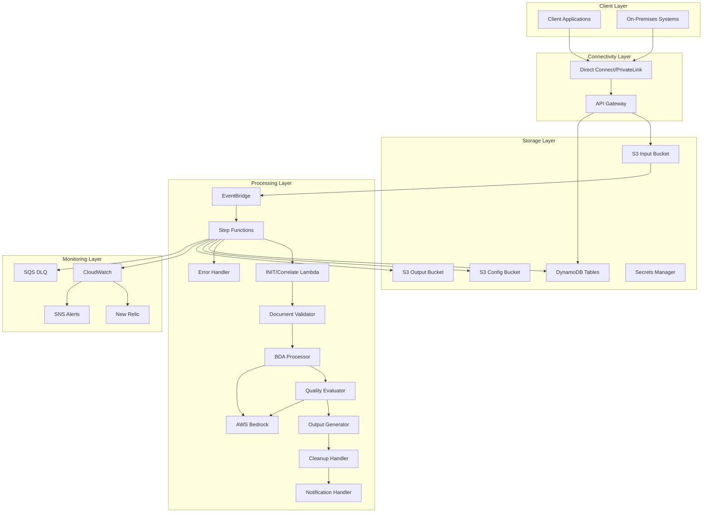

# Infrastructure Low-Level Design (LLD) Document
## Intelligent Document Processing (IDP) System

---

## 1. Executive Summary

This Infrastructure Low-Level Design document provides comprehensive technical specifications for implementing the Intelligent Document Processing (IDP) system on AWS. The solution migrates from Snowflake Cortex to a fully serverless AWS architecture, targeting 40-60% cost reduction, <15% manual intervention, and >95% accuracy.

### Key Business Outcomes
- **Cost Optimization**: 40-60% reduction through serverless architecture
- **Improved Accuracy**: >95% classification, >90% field extraction
- **Reduced Manual Intervention**: From 50% to <15%
- **Enhanced Scalability**: 100-500 documents/minute processing capacity
- **Operational Excellence**: Zero-downtime deployments and automated monitoring

### Architecture Principles
- **Serverless-First**: Eliminates infrastructure management overhead
- **Event-Driven**: Loose coupling enables independent scaling
- **Configuration-Driven**: Dynamic updates without code deployment
- **Security by Design**: Comprehensive data protection and access controls
- **Observability**: Built-in monitoring, logging, and alerting

---

## 2. Infrastructure Architecture Overview

### 2.1 High-Level Architecture

The IDP system leverages AWS serverless services in a fully managed architecture:



### 2.2 Network Architecture Strategy

**Serverless-First Approach**:
- **No VPC Required**: Lambda functions run in AWS-managed secure environment
- **Service Integration**: Direct AWS service communication via AWS backbone
- **Cost Optimization**: Eliminates NAT Gateway and VPC endpoint costs
- **Simplified Management**: Reduces networking complexity and maintenance

**Security Considerations**:
- **API Gateway**: Public endpoint with comprehensive security controls
- **Service-to-Service**: IAM-based authentication and authorization
- **Data Encryption**: In-transit and at-rest encryption for all services
- **Access Control**: Least privilege IAM policies and resource-based policies

**When VPC Might Be Required**:
- Integration with on-premises databases (not applicable)
- Custom network security requirements beyond AWS defaults
- Compliance mandates for network isolation

---

## 3. Terraform Infrastructure as Code

### 3.1 Terraform Project Structure

```
infrastructure/
├── environments/
│   ├── dev/
│   │   ├── main.tf
│   │   ├── variables.tf
│   │   └── terraform.tfvars
│   ├── nonprod/
│   │   ├── main.tf
│   │   ├── variables.tf
│   │   └── terraform.tfvars
│   └── prod/
│       ├── main.tf
│       ├── variables.tf
│       └── terraform.tfvars
├── modules/
│   ├── api-gateway/
│   ├── dynamodb/
│   ├── eventbridge/
│   ├── iam-roles/
│   ├── lambda-functions/
│   ├── monitoring/
│   ├── s3-buckets/
│   ├── secrets-manager/
│   ├── sqs/
│   └── step-functions/
├── shared/
│   ├── backend.tf
│   ├── provider.tf
│   └── versions.tf
└── scripts/
    ├── deploy.sh
    ├── validate.sh
    └── destroy.sh
```

### 3.2 Terraform Backend Configuration

```hcl
# shared/backend.tf
terraform {
  backend "s3" {
    bucket         = "idp-terraform-state-${var.environment}"
    key            = "infrastructure/terraform.tfstate"
    region         = "us-east-1"
    encrypt        = true
    dynamodb_table = "idp-terraform-locks-${var.environment}"
    
    # Workspace-based state isolation
    workspace_key_prefix = "environments"
  }
}

# shared/provider.tf
terraform {
  required_version = ">= 1.6.0"
  
  required_providers {
    aws = {
      source  = "hashicorp/aws"
      version = "~> 5.0"
    }
    random = {
      source  = "hashicorp/random"
      version = "~> 3.4"
    }
  }
}

provider "aws" {
  region = var.aws_region
  
  default_tags {
    tags = {
      Project     = "IDP"
      Environment = var.environment
      ManagedBy   = "Terraform"
      Owner       = "Evoke"
    }
  }
}
```

### 3.3 Environment-Specific Configuration

#### Development Environment
```hcl
# environments/dev/terraform.tfvars
environment = "dev"
aws_region  = "us-east-1"

# Lambda Configuration
lambda_memory_size = {
  init_correlate      = 256
  document_validator  = 256
  bda_processor      = 1024
  quality_evaluator  = 512
  output_generator   = 256
  cleanup_handler    = 256
  notification_handler = 256
  error_handler      = 256
}

lambda_timeout = {
  init_correlate      = 30
  document_validator  = 60
  bda_processor      = 300
  quality_evaluator  = 180
  output_generator   = 60
  cleanup_handler    = 60
  notification_handler = 30
  error_handler      = 60
}

# DynamoDB Configuration
dynamodb_billing_mode = "ON_DEMAND"
enable_point_in_time_recovery = true

# S3 Configuration
s3_versioning_enabled = true
s3_lifecycle_enabled = true

# Monitoring Configuration
cloudwatch_log_retention_days = 30
enable_xray_tracing = true

# Security Configuration
kms_key_rotation_enabled = true
```

#### Non-Production Environment
```hcl
# environments/nonprod/terraform.tfvars
environment = "nonprod"
aws_region  = "us-east-1"

# Enhanced resources for production-like testing
lambda_memory_size = {
  init_correlate      = 512
  document_validator  = 512
  bda_processor      = 2048
  quality_evaluator  = 1024
  output_generator   = 512
  cleanup_handler    = 512
  notification_handler = 512
  error_handler      = 512
}

# Extended timeouts for complex processing
lambda_timeout = {
  init_correlate      = 60
  document_validator  = 120
  bda_processor      = 600
  quality_evaluator  = 300
  output_generator   = 120
  cleanup_handler    = 120
  notification_handler = 60
  error_handler      = 120
}

# Production-like DynamoDB settings
dynamodb_billing_mode = "ON_DEMAND"
enable_point_in_time_recovery = true
enable_backup = true

# Extended log retention
cloudwatch_log_retention_days = 90
enable_xray_tracing = true

# Enhanced security
kms_key_rotation_enabled = true
enable_vpc_endpoints = true
```

---

## 4. Core Infrastructure Components

### 4.1 API Gateway Terraform Module

```hcl
# modules/api-gateway/main.tf
resource "aws_api_gateway_rest_api" "idp_api" {
  name        = "idp-api-${var.environment}"
  description = "IDP Document Processing API"
  
  endpoint_configuration {
    types = ["REGIONAL"]
  }
  
  binary_media_types = [
    "application/pdf",
    "image/jpeg",
    "image/jpg", 
    "image/tiff"
  ]
  
  tags = var.tags
}

# API Gateway Resources
resource "aws_api_gateway_resource" "upload" {
  rest_api_id = aws_api_gateway_rest_api.idp_api.id
  parent_id   = aws_api_gateway_rest_api.idp_api.root_resource_id
  path_part   = "upload"
}

resource "aws_api_gateway_resource" "status" {
  rest_api_id = aws_api_gateway_rest_api.idp_api.id
  parent_id   = aws_api_gateway_rest_api.idp_api.root_resource_id
  path_part   = "status"
}

resource "aws_api_gateway_resource" "status_document_id" {
  rest_api_id = aws_api_gateway_rest_api.idp_api.id
  parent_id   = aws_api_gateway_resource.status.id
  path_part   = "{documentId}"
}

# POST /upload method
resource "aws_api_gateway_method" "upload_post" {
  rest_api_id   = aws_api_gateway_rest_api.idp_api.id
  resource_id   = aws_api_gateway_resource.upload.id
  http_method   = "POST"
  authorization = "NONE"
  api_key_required = true
  
  request_validator_id = aws_api_gateway_request_validator.upload_validator.id
  
  request_models = {
    "application/json" = aws_api_gateway_model.upload_request.name
  }
}

# Lambda Integration for Upload
resource "aws_api_gateway_integration" "upload_lambda" {
  rest_api_id = aws_api_gateway_rest_api.idp_api.id
  resource_id = aws_api_gateway_resource.upload.id
  http_method = aws_api_gateway_method.upload_post.http_method
  
  integration_http_method = "POST"
  type                   = "AWS_PROXY"
  uri                    = var.upload_lambda_invoke_arn
}

# GET /status/{documentId} method
resource "aws_api_gateway_method" "status_get" {
  rest_api_id   = aws_api_gateway_rest_api.idp_api.id
  resource_id   = aws_api_gateway_resource.status_document_id.id
  http_method   = "GET"
  authorization = "NONE"
  api_key_required = true
  
  request_parameters = {
    "method.request.path.documentId" = true
  }
}

# Lambda Integration for Status
resource "aws_api_gateway_integration" "status_lambda" {
  rest_api_id = aws_api_gateway_rest_api.idp_api.id
  resource_id = aws_api_gateway_resource.status_document_id.id
  http_method = aws_api_gateway_method.status_get.http_method
  
  integration_http_method = "POST"
  type                   = "AWS_PROXY"
  uri                    = var.status_lambda_invoke_arn
}

# Request Validator
resource "aws_api_gateway_request_validator" "upload_validator" {
  name                        = "upload-validator"
  rest_api_id                = aws_api_gateway_rest_api.idp_api.id
  validate_request_body       = true
  validate_request_parameters = true
}

# Request Model for Upload
resource "aws_api_gateway_model" "upload_request" {
  rest_api_id  = aws_api_gateway_rest_api.idp_api.id
  name         = "UploadRequest"
  content_type = "application/json"
  
  schema = jsonencode({
    "$schema": "http://json-schema.org/draft-04/schema#",
    "title": "Upload Request Schema",
    "type": "object",
    "properties": {
      "document_type": {
        "type": "string",
        "enum": ["ID", "POA", "SOF", "PH_ID", "MFT", "LEGAL_CLAIM"]
      },
      "callback_url": {
        "type": "string",
        "format": "uri"
      },
      "tenant": {
        "type": "string"
      },
      "country": {
        "type": "string"
      },
      "metadata": {
        "type": "object"
      }
    },
    "required": ["document_type", "callback_url", "tenant"]
  })
}

# API Gateway Deployment
resource "aws_api_gateway_deployment" "idp_deployment" {
  depends_on = [
    aws_api_gateway_integration.upload_lambda,
    aws_api_gateway_integration.status_lambda,
  ]
  
  rest_api_id = aws_api_gateway_rest_api.idp_api.id
  stage_name  = var.environment
  
  variables = {
    deployed_at = timestamp()
  }
  
  lifecycle {
    create_before_destroy = true
  }
}

# API Gateway Stage
resource "aws_api_gateway_stage" "idp_stage" {
  deployment_id = aws_api_gateway_deployment.idp_deployment.id
  rest_api_id   = aws_api_gateway_rest_api.idp_api.id
  stage_name    = var.environment
  
  xray_tracing_enabled = var.enable_xray_tracing
  
  access_log_settings {
    destination_arn = aws_cloudwatch_log_group.api_gateway_logs.arn
    format = jsonencode({
      requestId      = "$context.requestId"
      ip            = "$context.identity.sourceIp"
      caller        = "$context.identity.caller"
      user          = "$context.identity.user"
      requestTime   = "$context.requestTime"
      httpMethod    = "$context.httpMethod"
      resourcePath  = "$context.resourcePath"
      status        = "$context.status"
      protocol      = "$context.protocol"
      responseLength = "$context.responseLength"
    })
  }
  
  tags = var.tags
}

# Usage Plan for Rate Limiting
resource "aws_api_gateway_usage_plan" "idp_usage_plan" {
  name         = "idp-usage-plan-${var.environment}"
  description  = "Usage plan for IDP API"
  
  api_stages {
    api_id = aws_api_gateway_rest_api.idp_api.id
    stage  = aws_api_gateway_stage.idp_stage.stage_name
  }
  
  quota_settings {
    limit  = 10000
    period = "DAY"
  }
  
  throttle_settings {
    rate_limit  = 100
    burst_limit = 200
  }
  
  tags = var.tags
}

# API Key
resource "aws_api_gateway_api_key" "idp_api_key" {
  name        = "idp-api-key-${var.environment}"
  description = "API Key for IDP service"
  enabled     = true
  
  tags = var.tags
}

# Usage Plan Key
resource "aws_api_gateway_usage_plan_key" "idp_usage_plan_key" {
  key_id        = aws_api_gateway_api_key.idp_api_key.id
  key_type      = "API_KEY"
  usage_plan_id = aws_api_gateway_usage_plan.idp_usage_plan.id
}

# CloudWatch Log Group for API Gateway
resource "aws_cloudwatch_log_group" "api_gateway_logs" {
  name              = "/aws/apigateway/idp-api-${var.environment}"
  retention_in_days = var.cloudwatch_log_retention_days
  kms_key_id        = var.kms_key_arn
  
  tags = var.tags
}
```

```hcl
# modules/api-gateway/variables.tf
variable "environment" {
  description = "Environment name"
  type        = string
}

variable "tags" {
  description = "Tags to apply to resources"
  type        = map(string)
  default     = {}
}

variable "upload_lambda_invoke_arn" {
  description = "ARN of the upload Lambda function"
  type        = string
}

variable "status_lambda_invoke_arn" {
  description = "ARN of the status Lambda function"
  type        = string
}

variable "enable_xray_tracing" {
  description = "Enable X-Ray tracing"
  type        = bool
  default     = true
}

variable "cloudwatch_log_retention_days" {
  description = "CloudWatch log retention in days"
  type        = number
  default     = 30
}

variable "kms_key_arn" {
  description = "KMS key ARN for encryption"
  type        = string
}
```

```hcl
# modules/api-gateway/outputs.tf
output "api_gateway_id" {
  description = "ID of the API Gateway"
  value       = aws_api_gateway_rest_api.idp_api.id
}

output "api_gateway_arn" {
  description = "ARN of the API Gateway"
  value       = aws_api_gateway_rest_api.idp_api.arn
}

output "api_gateway_url" {
  description = "URL of the API Gateway"
  value       = "https://${aws_api_gateway_rest_api.idp_api.id}.execute-api.${data.aws_region.current.name}.amazonaws.com/${var.environment}"
}

output "api_key_id" {
  description = "ID of the API key"
  value       = aws_api_gateway_api_key.idp_api_key.id
}

output "api_key_value" {
  description = "Value of the API key"
  value       = aws_api_gateway_api_key.idp_api_key.value
  sensitive   = true
}

data "aws_region" "current" {}
```

### 4.2 S3 Buckets Terraform Module

```hcl
# modules/s3-buckets/main.tf
# Input Documents Bucket
resource "aws_s3_bucket" "idp_input_documents" {
  bucket = "idp-input-documents-${var.environment}-${random_id.bucket_suffix.hex}"
  
  tags = merge(var.tags, {
    Purpose = "Document Input Storage"
  })
}

resource "aws_s3_bucket_versioning" "input_versioning" {
  bucket = aws_s3_bucket.idp_input_documents.id
  versioning_configuration {
    status = "Disabled"  # Temporary storage, no versioning needed
  }
}

resource "aws_s3_bucket_encryption" "input_encryption" {
  bucket = aws_s3_bucket.idp_input_documents.id
  
  server_side_encryption_configuration {
    rule {
      apply_server_side_encryption_by_default {
        kms_master_key_id = var.kms_key_arn
        sse_algorithm     = "aws:kms"
      }
      bucket_key_enabled = true
    }
  }
}

resource "aws_s3_bucket_lifecycle_configuration" "input_lifecycle" {
  bucket = aws_s3_bucket.idp_input_documents.id
  
  rule {
    id     = "delete_after_processing"
    status = "Enabled"
    
    expiration {
      days = 1
    }
    
    abort_incomplete_multipart_upload {
      days_after_initiation = 1
    }
  }
}

resource "aws_s3_bucket_notification" "input_notification" {
  bucket      = aws_s3_bucket.idp_input_documents.id
  eventbridge = true
}

resource "aws_s3_bucket_public_access_block" "input_pab" {
  bucket = aws_s3_bucket.idp_input_documents.id
  
  block_public_acls       = true
  block_public_policy     = true
  ignore_public_acls      = true
  restrict_public_buckets = true
}

# Configuration Bucket
resource "aws_s3_bucket" "idp_configuration" {
  bucket = "idp-configuration-${var.environment}-${random_id.bucket_suffix.hex}"
  
  tags = merge(var.tags, {
    Purpose = "Configuration Storage"
  })
}

resource "aws_s3_bucket_versioning" "config_versioning" {
  bucket = aws_s3_bucket.idp_configuration.id
  versioning_configuration {
    status = "Enabled"
  }
}

resource "aws_s3_bucket_encryption" "config_encryption" {
  bucket = aws_s3_bucket.idp_configuration.id
  
  server_side_encryption_configuration {
    rule {
      apply_server_side_encryption_by_default {
        kms_master_key_id = var.kms_key_arn
        sse_algorithm     = "aws:kms"
      }
      bucket_key_enabled = true
    }
  }
}

# Output Results Bucket
resource "aws_s3_bucket" "idp_output_results" {
  bucket = "idp-output-results-${var.environment}-${random_id.bucket_suffix.hex}"
  
  tags = merge(var.tags, {
    Purpose = "Processing Results Storage"
  })
}

resource "aws_s3_bucket_versioning" "output_versioning" {
  bucket = aws_s3_bucket.idp_output_results.id
  versioning_configuration {
    status = "Enabled"
  }
}

resource "aws_s3_bucket_encryption" "output_encryption" {
  bucket = aws_s3_bucket.idp_output_results.id
  
  server_side_encryption_configuration {
    rule {
      apply_server_side_encryption_by_default {
        kms_master_key_id = var.kms_key_arn
        sse_algorithm     = "aws:kms"
      }
      bucket_key_enabled = true
    }
  }
}

resource "aws_s3_bucket_lifecycle_configuration" "output_lifecycle" {
  bucket = aws_s3_bucket.idp_output_results.id
  
  rule {
    id     = "archive_and_delete"
    status = "Enabled"
    
    transition {
      days          = 30
      storage_class = "STANDARD_IA"
    }
    
    transition {
      days          = 60
      storage_class = "GLACIER"
    }
    
    expiration {
      days = 90
    }
  }
}

resource "aws_s3_bucket_public_access_block" "output_pab" {
  bucket = aws_s3_bucket.idp_output_results.id
  
  block_public_acls       = true
  block_public_policy     = true
  ignore_public_acls      = true
  restrict_public_buckets = true
}

# Random suffix for bucket names
resource "random_id" "bucket_suffix" {
  byte_length = 4
}

# Bucket Policies
resource "aws_s3_bucket_policy" "input_bucket_policy" {
  bucket = aws_s3_bucket.idp_input_documents.id
  
  policy = jsonencode({
    Version = "2012-10-17"
    Statement = [
      {
        Sid       = "DenyInsecureConnections"
        Effect    = "Deny"
        Principal = "*"
        Action    = "s3:*"
        Resource = [
          aws_s3_bucket.idp_input_documents.arn,
          "${aws_s3_bucket.idp_input_documents.arn}/*"
        ]
        Condition = {
          Bool = {
            "aws:SecureTransport" = "false"
          }
        }
      },
      {
        Sid    = "AllowLambdaAccess"
        Effect = "Allow"
        Principal = {
          AWS = var.lambda_execution_role_arns
        }
        Action = [
          "s3:GetObject",
          "s3:GetObjectMetadata"
        ]
        Resource = "${aws_s3_bucket.idp_input_documents.arn}/*"
      }
    ]
  })
}

resource "aws_s3_bucket_policy" "config_bucket_policy" {
  bucket = aws_s3_bucket.idp_configuration.id
  
  policy = jsonencode({
    Version = "2012-10-17"
    Statement = [
      {
        Sid       = "DenyInsecureConnections"
        Effect    = "Deny"
        Principal = "*"
        Action    = "s3:*"
        Resource = [
          aws_s3_bucket.idp_configuration.arn,
          "${aws_s3_bucket.idp_configuration.arn}/*"
        ]
        Condition = {
          Bool = {
            "aws:SecureTransport" = "false"
          }
        }
      },
      {
        Sid    = "AllowLambdaReadAccess"
        Effect = "Allow"
        Principal = {
          AWS = var.lambda_execution_role_arns
        }
        Action = [
          "s3:GetObject",
          "s3:ListBucket"
        ]
        Resource = [
          aws_s3_bucket.idp_configuration.arn,
          "${aws_s3_bucket.idp_configuration.arn}/*"
        ]
      }
    ]
  })
}
```

```hcl
# modules/s3-buckets/variables.tf
variable "environment" {
  description = "Environment name"
  type        = string
}

variable "tags" {
  description = "Tags to apply to resources"
  type        = map(string)
  default     = {}
}

variable "kms_key_arn" {
  description = "KMS key ARN for encryption"
  type        = string
}

variable "lambda_execution_role_arns" {
  description = "List of Lambda execution role ARNs"
  type        = list(string)
}

variable "s3_versioning_enabled" {
  description = "Enable S3 versioning"
  type        = bool
  default     = true
}

variable "s3_lifecycle_enabled" {
  description = "Enable S3 lifecycle policies"
  type        = bool
  default     = true
}
```

```hcl
# modules/s3-buckets/outputs.tf
output "input_bucket_name" {
  description = "Name of the input documents bucket"
  value       = aws_s3_bucket.idp_input_documents.bucket
}

output "input_bucket_arn" {
  description = "ARN of the input documents bucket"
  value       = aws_s3_bucket.idp_input_documents.arn
}

output "config_bucket_name" {
  description = "Name of the configuration bucket"
  value       = aws_s3_bucket.idp_configuration.bucket
}

output "config_bucket_arn" {
  description = "ARN of the configuration bucket"
  value       = aws_s3_bucket.idp_configuration.arn
}

output "output_bucket_name" {
  description = "Name of the output results bucket"
  value       = aws_s3_bucket.idp_output_results.bucket
}

output "output_bucket_arn" {
  description = "ARN of the output results bucket"
  value       = aws_s3_bucket.idp_output_results.arn
}
```

### 3.3 DynamoDB Tables Design

#### Document Metadata Table
```yaml
Table Configuration:
  Name: idp-document-metadata-{environment}
  Partition Key: document_id (String)
  Sort Key: None
  Billing Mode: On-Demand
  Encryption: Customer-managed KMS key
  
  Attributes:
    - document_id: Primary identifier
    - correlation_id: Tracing identifier
    - tenant: Client organization
    - country: Processing jurisdiction
    - document_type: Classified type
    - status: Processing state
    - created_at: Upload timestamp
    - updated_at: Last modification
    - s3_input_key: Source document location
    - s3_output_key: Result location
    - confidence_scores: Processing confidence
    - config_version: Configuration used
    - enriched_context: Client-specific data
  
  Global Secondary Indexes:
    - GSI1: tenant-created_at-index
    - GSI2: status-updated_at-index
    - GSI3: correlation_id-index
  
  Point-in-Time Recovery: Enabled
  Backup: Daily automated backups
  TTL: 90 days on created_at field
```

#### Processing State Table
```yaml
Table Configuration:
  Name: idp-processing-state-{environment}
  Partition Key: execution_id (String)
  Sort Key: step_name (String)
  Billing Mode: On-Demand
  
  Attributes:
    - execution_id: Step Functions execution ID
    - step_name: Processing step identifier
    - step_status: Step completion status
    - input_data: Step input parameters
    - output_data: Step results
    - error_details: Failure information
    - duration_ms: Processing time
    - timestamp: Step completion time
  
  TTL: 30 days on timestamp field
```

### 3.4 Lambda Functions Architecture

#### Function Specifications Overview
```yaml
Common Configuration:
  Runtime: Python 3.11
  Architecture: x86_64
  Environment Variables:
    - ENVIRONMENT: {environment}
    - LOG_LEVEL: INFO
    - POWERTOOLS_SERVICE_NAME: idp
    - POWERTOOLS_METRICS_NAMESPACE: IDP
  
  Monitoring:
    - X-Ray Tracing: Active
    - CloudWatch Insights: Enabled
    - Custom Metrics: Business and technical metrics
  
  Security:
    - Execution Role: Function-specific IAM roles
    - Environment Encryption: KMS encrypted
    - VPC: Not required (serverless approach)
```

#### 1. INIT/Correlate Lambda
```yaml
Function Configuration:
  Name: idp-init-correlate-{environment}
  Memory: 256 MB
  Timeout: 30 seconds
  Concurrency: 100
  
  Purpose:
    - Generate correlation IDs for tracing
    - Load client-specific configuration
    - Validate IAM permissions
    - Enrich processing context
  
  IAM Permissions:
    - DynamoDB: GetItem, PutItem, UpdateItem
    - S3: GetObject (config bucket)
    - Secrets Manager: GetSecretValue
    - CloudWatch: PutMetricData
```

#### 2. Document Validator Lambda
```yaml
Function Configuration:
  Name: idp-document-validator-{environment}
  Memory: 256 MB
  Timeout: 60 seconds
  Concurrency: 200
  
  Validation Checks:
    - File Format: PDF, JPG, JPEG, TIFF only
    - File Size: Maximum 10MB
    - File Accessibility: S3 object exists and readable
    - Metadata Integrity: Required fields present
  
  IAM Permissions:
    - S3: GetObject, GetObjectMetadata
    - DynamoDB: GetItem, UpdateItem
    - CloudWatch: PutMetricData
```

#### 3. BDA Processor Lambda
```yaml
Function Configuration:
  Name: idp-bda-processor-{environment}
  Memory: 1024 MB
  Timeout: 300 seconds (5 minutes)
  Concurrency: 50
  
  Processing Capabilities:
    - Language Detection: >95% accuracy
    - Document Classification: Confidence scoring
    - Field Extraction: Schema-based extraction
    - Quality Assessment: Confidence validation
  
  IAM Permissions:
    - Bedrock: InvokeModel, InvokeModelWithResponseStream
    - Bedrock Agent: Full access for BDA operations
    - S3: GetObject (input and config buckets)
    - DynamoDB: GetItem, PutItem, UpdateItem
    - CloudWatch: PutMetricData
```

#### 4. Quality Evaluator Lambda
```yaml
Function Configuration:
  Name: idp-quality-evaluator-{environment}
  Memory: 512 MB
  Timeout: 180 seconds
  Concurrency: 100
  
  Evaluation Metrics:
    - Classification Accuracy: Document type correctness
    - Field Precision: Extracted value accuracy
    - Field Recall: Required field completeness
    - Confidence Calibration: Threshold compliance
  
  LLM Integration:
    - Model: Claude Haiku for cost-effective evaluation
    - Prompt: Structured evaluation template
    - Output: JSON quality scores and explanations
```

#### 5. Output Generator Lambda
```yaml
Function Configuration:
  Name: idp-output-generator-{environment}
  Memory: 256 MB
  Timeout: 60 seconds
  Concurrency: 200
  
  Output Format:
    - Structured JSON with extracted fields
    - Confidence scores per field
    - Processing metadata and timestamps
    - Quality assessment results
    - Error details (if applicable)
  
  Size Constraints:
    - Maximum output size: 256 KB
    - Compression: Enabled for large outputs
    - Validation: Schema compliance checking
```

#### 6. Cleanup Handler Lambda
```yaml
Function Configuration:
  Name: idp-cleanup-handler-{environment}
  Memory: 256 MB
  Timeout: 60 seconds
  Concurrency: 100
  
  Cleanup Operations:
    - Delete input documents from S3
    - Update processing status in DynamoDB
    - Clean temporary processing artifacts
    - Log cleanup completion
  
  Error Handling:
    - Retry logic for failed deletions
    - Dead letter queue for persistent failures
    - Alerting for cleanup failures
```

#### 7. Notification Handler Lambda
```yaml
Function Configuration:
  Name: idp-notification-handler-{environment}
  Memory: 256 MB
  Timeout: 30 seconds
  Concurrency: 200
  
  Notification Types:
    - Success: Processing completed successfully
    - Error: Processing failed with details
    - Manual Review: Low confidence requiring review
  
  Delivery Methods:
    - HTTP POST callbacks to client URLs
    - Retry logic: 3 attempts with exponential backoff
    - Dead letter queue for failed notifications
```

#### 8. Error Handler Lambda
```yaml
Function Configuration:
  Name: idp-error-handler-{environment}
  Memory: 256 MB
  Timeout: 60 seconds
  Concurrency: 50
  
  Error Processing:
    - Parse error details from Step Functions
    - Categorize errors (transient vs permanent)
    - Update processing status
    - Send error notifications
    - Log error details for analysis
```

### 3.5 Step Functions Workflow Design

#### State Machine Configuration
```yaml
State Machine:
  Name: idp-document-processing-{environment}
  Type: Standard
  Logging: ALL (execution data included)
  X-Ray Tracing: Enabled
  
  Execution Role Permissions:
    - Lambda: InvokeFunction for all processing functions
    - SQS: SendMessage to DLQ and manual review queue
    - CloudWatch: PutMetricData and CreateLogStream
    - DynamoDB: GetItem, PutItem, UpdateItem
```

#### Workflow States Definition
```json
{
  "Comment": "IDP Document Processing Workflow",
  "StartAt": "InitCorrelate",
  "States": {
    "InitCorrelate": {
      "Type": "Task",
      "Resource": "arn:aws:lambda:region:account:function:idp-init-correlate-env",
      "Retry": [
        {
          "ErrorEquals": ["Lambda.ServiceException", "Lambda.AWSLambdaException"],
          "IntervalSeconds": 2,
          "MaxAttempts": 3,
          "BackoffRate": 2.0
        }
      ],
      "Catch": [
        {
          "ErrorEquals": ["States.ALL"],
          "Next": "ErrorHandler",
          "ResultPath": "$.error"
        }
      ],
      "Next": "DocumentValidator"
    },
    "DocumentValidator": {
      "Type": "Task",
      "Resource": "arn:aws:lambda:region:account:function:idp-document-validator-env",
      "Retry": [
        {
          "ErrorEquals": ["Lambda.ServiceException"],
          "IntervalSeconds": 1,
          "MaxAttempts": 2,
          "BackoffRate": 2.0
        }
      ],
      "Catch": [
        {
          "ErrorEquals": ["ValidationError"],
          "Next": "ErrorHandler",
          "ResultPath": "$.error"
        }
      ],
      "Next": "BDAProcessor"
    },
    "BDAProcessor": {
      "Type": "Task",
      "Resource": "arn:aws:lambda:region:account:function:idp-bda-processor-env",
      "TimeoutSeconds": 300,
      "Retry": [
        {
          "ErrorEquals": ["Lambda.TooManyRequestsException"],
          "IntervalSeconds": 5,
          "MaxAttempts": 3,
          "BackoffRate": 2.0
        }
      ],
      "Next": "ConfidenceCheck"
    },
    "ConfidenceCheck": {
      "Type": "Choice",
      "Choices": [
        {
          "Variable": "$.confidence_score",
          "NumericGreaterThanEquals": 0.85,
          "Next": "QualityEvaluator"
        }
      ],
      "Default": "ManualReviewQueue"
    },
    "QualityEvaluator": {
      "Type": "Task",
      "Resource": "arn:aws:lambda:region:account:function:idp-quality-evaluator-env",
      "Next": "OutputGenerator"
    },
    "OutputGenerator": {
      "Type": "Task",
      "Resource": "arn:aws:lambda:region:account:function:idp-output-generator-env",
      "Next": "CleanupHandler"
    },
    "CleanupHandler": {
      "Type": "Task",
      "Resource": "arn:aws:lambda:region:account:function:idp-cleanup-handler-env",
      "Next": "NotificationHandler"
    },
    "NotificationHandler": {
      "Type": "Task",
      "Resource": "arn:aws:lambda:region:account:function:idp-notification-handler-env",
      "End": true
    },
    "ManualReviewQueue": {
      "Type": "Task",
      "Resource": "arn:aws:states:::sqs:sendMessage",
      "Parameters": {
        "QueueUrl": "https://sqs.region.amazonaws.com/account/idp-manual-review-queue-env",
        "MessageBody.$": "$"
      },
      "Next": "NotificationHandler"
    },
    "ErrorHandler": {
      "Type": "Task",
      "Resource": "arn:aws:lambda:region:account:function:idp-error-handler-env",
      "End": true
    }
  }
}
```

### 3.6 EventBridge Configuration

#### Event Rules and Targets
```yaml
EventBridge Rules:
  - Name: idp-s3-document-upload-{environment}
    EventPattern:
      source: ["aws.s3"]
      detail-type: ["Object Created"]
      detail:
        bucket:
          name: ["idp-input-documents-{environment}"]
        object:
          key:
            - suffix: [".pdf", ".jpg", ".jpeg", ".tiff"]
    
    Targets:
      - Id: "StepFunctionsTarget"
        Arn: "arn:aws:states:region:account:stateMachine:idp-document-processing-{environment}"
        RoleArn: "arn:aws:iam::account:role/idp-eventbridge-role-{environment}"
        InputTransformer:
          InputPathsMap:
            bucket: "$.detail.bucket.name"
            key: "$.detail.object.key"
          InputTemplate: |
            {
              "document_id": "<key>",
              "s3_bucket": "<bucket>",
              "s3_key": "<key>",
              "timestamp": "<aws.events.event.ingestion-time>"
            }
```

### 3.7 SQS Queue Configuration

#### Manual Review Queue
```yaml
Queue Configuration:
  Name: idp-manual-review-queue-{environment}
  Type: Standard Queue
  Visibility Timeout: 300 seconds
  Message Retention: 14 days
  Receive Message Wait Time: 20 seconds (long polling)
  
  Dead Letter Queue:
    Name: idp-manual-review-dlq-{environment}
    Max Receive Count: 3
  
  Encryption:
    Type: KMS
    Key: Customer-managed key
  
  Access Policy:
    - Step Functions: SendMessage permission
    - Manual Review Service: ReceiveMessage, DeleteMessage
```

#### Dead Letter Queue
```yaml
Queue Configuration:
  Name: idp-processing-dlq-{environment}
  Type: Standard Queue
  Message Retention: 14 days
  
  Monitoring:
    - CloudWatch Alarm: Message count > 0
    - SNS Notification: Immediate alert to operations team
  
  Processing:
    - Error Handler Lambda: Processes DLQ messages
    - Manual Investigation: For persistent failures
```

---

## 4. Security Architecture

### 4.1 Identity and Access Management (IAM)

#### Service Roles Strategy
```yaml
IAM Role Design Principles:
  - Least Privilege: Minimum permissions required
  - Function-Specific: Dedicated roles per Lambda function
  - Resource-Based: Policies scoped to specific resources
  - Temporary Credentials: No long-term access keys
  
Role Categories:
  - Lambda Execution Roles: Per-function permissions
  - Step Functions Role: Workflow orchestration permissions
  - EventBridge Role: Event routing permissions
  - API Gateway Role: Service integration permissions
```

#### Lambda Function IAM Roles
```json
{
  "DocumentValidatorRole": {
    "AssumeRolePolicyDocument": {
      "Version": "2012-10-17",
      "Statement": [
        {
          "Effect": "Allow",
          "Principal": {
            "Service": "lambda.amazonaws.com"
          },
          "Action": "sts:AssumeRole"
        }
      ]
    },
    "Policies": [
      {
        "PolicyName": "DocumentValidatorPolicy",
        "PolicyDocument": {
          "Version": "2012-10-17",
          "Statement": [
            {
              "Effect": "Allow",
              "Action": [
                "s3:GetObject",
                "s3:GetObjectMetadata"
              ],
              "Resource": "arn:aws:s3:::idp-input-documents-{environment}/*"
            },
            {
              "Effect": "Allow",
              "Action": [
                "dynamodb:GetItem",
                "dynamodb:PutItem",
                "dynamodb:UpdateItem"
              ],
              "Resource": "arn:aws:dynamodb:region:account:table/idp-document-metadata-{environment}"
            },
            {
              "Effect": "Allow",
              "Action": [
                "logs:CreateLogGroup",
                "logs:CreateLogStream",
                "logs:PutLogEvents"
              ],
              "Resource": "arn:aws:logs:region:account:*"
            }
          ]
        }
      }
    ]
  }
}
```

#### BDA Processor Enhanced Permissions
```json
{
  "BDAProcessorRole": {
    "Policies": [
      {
        "PolicyName": "BedrockAccess",
        "PolicyDocument": {
          "Version": "2012-10-17",
          "Statement": [
            {
              "Effect": "Allow",
              "Action": [
                "bedrock:InvokeModel",
                "bedrock:InvokeModelWithResponseStream"
              ],
              "Resource": [
                "arn:aws:bedrock:*:*:foundation-model/anthropic.claude-3-sonnet-20240229-v1:0",
                "arn:aws:bedrock:*:*:foundation-model/anthropic.claude-3-haiku-20240307-v1:0"
              ]
            },
            {
              "Effect": "Allow",
              "Action": [
                "bedrock-agent:*"
              ],
              "Resource": "*",
              "Condition": {
                "StringEquals": {
                  "aws:RequestedRegion": "us-east-1"
                }
              }
            }
          ]
        }
      }
    ]
  }
}
```

### 4.2 Data Encryption Strategy

#### Encryption at Rest
```yaml
S3 Buckets:
  Encryption: AES-256 with Customer-Managed KMS Keys
  Key Rotation: Annual automatic rotation
  Access Logging: Enabled for all buckets
  
DynamoDB Tables:
  Encryption: Customer-Managed KMS Keys
  Key Usage: Separate keys per environment
  Backup Encryption: Same key as table encryption
  
Lambda Functions:
  Environment Variables: KMS encrypted
  Code Packages: Encrypted in S3
  
Secrets Manager:
  Encryption: Customer-Managed KMS Keys
  Rotation: Automatic for supported secret types
```

#### Encryption in Transit
```yaml
API Gateway:
  TLS Version: 1.2 minimum
  Certificate: AWS Certificate Manager
  HSTS: Enabled with max-age=31536000
  
Service-to-Service:
  AWS Backbone: Native encryption
  Lambda to Bedrock: HTTPS/TLS 1.2
  Lambda to DynamoDB: AWS SDK encryption
  
Client Connections:
  Pre-signed URLs: HTTPS only
  API Endpoints: TLS 1.2 minimum
  Callback URLs: HTTPS required
```

### 4.3 Network Security

#### API Gateway Security Controls
```yaml
Security Configuration:
  Authentication:
    - API Keys: Required for all endpoints
    - Usage Plans: Rate limiting per client
    - Resource Policies: IP-based restrictions (optional)
  
  Request Validation:
    - JSON Schema: Validate request bodies
    - Parameter Validation: Required fields checking
    - Size Limits: Maximum request size 10MB
  
  Response Security:
    - CORS: Configured for web clients
    - Security Headers: HSTS, X-Content-Type-Options
    - Error Handling: No sensitive data in error responses
```

#### Service Integration Security
```yaml
Lambda Functions:
  Network: AWS-managed VPC (no custom VPC required)
  Internet Access: Via AWS backbone for Bedrock calls
  Service Endpoints: VPC endpoints for cost optimization (optional)
  
Bedrock Integration:
  Authentication: IAM roles and policies
  Network: AWS backbone communication
  Data Residency: Configurable region selection
  
S3 Access:
  Bucket Policies: Restrict access to authorized services
  Pre-signed URLs: Time-limited access for uploads
  Access Logging: Comprehensive audit trails
```

### 4.4 Secrets Management

#### AWS Secrets Manager Configuration
```yaml
Secrets Structure:
  - Name: idp/api-keys/{environment}
    Description: Client API keys for authentication
    Rotation: Manual (on-demand)
    
  - Name: idp/callback-credentials/{environment}
    Description: Credentials for client callback authentication
    Rotation: Quarterly automatic
    
  - Name: idp/new-relic/{environment}
    Description: New Relic integration credentials
    Rotation: Annual manual
    
Access Control:
  - Lambda Functions: GetSecretValue permission
  - CI/CD Pipeline: Limited read access for deployment
  - Administrators: Full access with MFA requirement
  
Encryption:
  - KMS Key: Customer-managed key per environment
  - Cross-Region: Replicated for disaster recovery
```

---

## 13. GitLab CI/CD Pipeline Implementation

### 13.1 Simplified GitLab CI/CD Structure

```
├── .gitlab-ci.yml                    # Main pipeline file
├── infrastructure/                   # Terraform code
│   ├── main.tf
│   ├── variables.tf
│   ├── outputs.tf
│   ├── dev.tfvars
│   └── nonprod.tfvars
├── src/                              # Lambda source code
└── config/                           # BDA configuration files
```

### 13.2 Single GitLab CI/CD Pipeline (.gitlab-ci.yml)

```yaml
# .gitlab-ci.yml - Single pipeline for everything
variables:
  TF_VERSION: "1.6.0"
  PYTHON_VERSION: "3.11"
  AWS_DEFAULT_REGION: us-east-1

stages:
  - validate
  - build
  - deploy-dev
  - test
  - deploy-nonprod

# Validate Terraform and Python code
validate:
  stage: validate
  image: hashicorp/terraform:$TF_VERSION
  script:
    - cd infrastructure/
    - terraform init -backend=false
    - terraform validate
    - terraform fmt -check
  rules:
    - changes:
        - infrastructure/**/*
        - src/**/*
        - config/**/*

# Build Lambda packages
build:
  stage: build
  image: python:$PYTHON_VERSION
  script:
    - pip install -r requirements.txt -t package/
    - cp -r src/* package/
    - cd package && zip -r ../lambda-functions.zip .
  artifacts:
    paths:
      - lambda-functions.zip
    expire_in: 1 hour
  rules:
    - changes:
        - src/**/*

# Deploy to Dev environment
deploy-dev:
  stage: deploy-dev
  image: hashicorp/terraform:$TF_VERSION
  environment:
    name: dev
  script:
    # Deploy infrastructure
    - cd infrastructure/
    - terraform init
    - terraform workspace select dev || terraform workspace new dev
    - terraform apply -var-file="dev.tfvars" -auto-approve
    
    # Deploy Lambda functions if code changed
    - |
      if [ -f "../lambda-functions.zip" ]; then
        aws lambda update-function-code --function-name idp-processor-dev --zip-file fileb://../lambda-functions.zip
      fi
  rules:
    - if: $CI_COMMIT_BRANCH == "main"

# Run integration tests
test:
  stage: test
  image: python:$PYTHON_VERSION
  script:
    - pip install pytest boto3
    - pytest tests/integration/ --env=dev
  dependencies:
    - deploy-dev

# Deploy to NonProd (manual approval)
deploy-nonprod:
  stage: deploy-nonprod
  image: hashicorp/terraform:$TF_VERSION
  environment:
    name: nonprod
  script:
    - cd infrastructure/
    - terraform init
    - terraform workspace select nonprod || terraform workspace new nonprod
    - terraform apply -var-file="nonprod.tfvars" -auto-approve
    
    # Deploy Lambda functions
    - |
      if [ -f "../lambda-functions.zip" ]; then
        aws lambda update-function-code --function-name idp-processor-nonprod --zip-file fileb://../lambda-functions.zip
      fi
  when: manual
  dependencies:
    - test
  rules:
    - if: $CI_COMMIT_BRANCH == "main"
```

### 13.3 Simplified Terraform Structure

```hcl
# infrastructure/main.tf - Everything in one file for simplicity
terraform {
  required_version = ">= 1.6.0"
  
  backend "s3" {
    bucket = "idp-terraform-state"
    key    = "infrastructure/terraform.tfstate"
    region = "us-east-1"
  }
  
  required_providers {
    aws = {
      source  = "hashicorp/aws"
      version = "~> 5.0"
    }
  }
}

provider "aws" {
  region = var.aws_region
  
  default_tags {
    tags = {
      Project     = "IDP"
      Environment = var.environment
      ManagedBy   = "Terraform"
    }
  }
}

# S3 Buckets
resource "aws_s3_bucket" "input_documents" {
  bucket = "idp-input-${var.environment}-${random_id.suffix.hex}"
}

resource "aws_s3_bucket" "configuration" {
  bucket = "idp-config-${var.environment}-${random_id.suffix.hex}"
}

resource "aws_s3_bucket" "output_results" {
  bucket = "idp-output-${var.environment}-${random_id.suffix.hex}"
}

resource "random_id" "suffix" {
  byte_length = 4
}

# DynamoDB Table
resource "aws_dynamodb_table" "document_metadata" {
  name           = "idp-documents-${var.environment}"
  billing_mode   = "ON_DEMAND"
  hash_key       = "document_id"
  
  attribute {
    name = "document_id"
    type = "S"
  }
}

# Lambda Function
resource "aws_lambda_function" "processor" {
  filename         = "../lambda-functions.zip"
  function_name    = "idp-processor-${var.environment}"
  role            = aws_iam_role.lambda_role.arn
  handler         = "main.handler"
  runtime         = "python3.11"
  timeout         = 300
  memory_size     = 1024
}

# IAM Role for Lambda
resource "aws_iam_role" "lambda_role" {
  name = "idp-lambda-role-${var.environment}"
  
  assume_role_policy = jsonencode({
    Version = "2012-10-17"
    Statement = [
      {
        Action = "sts:AssumeRole"
        Effect = "Allow"
        Principal = {
          Service = "lambda.amazonaws.com"
        }
      }
    ]
  })
}

# Step Functions
resource "aws_sfn_state_machine" "processor" {
  name     = "idp-processor-${var.environment}"
  role_arn = aws_iam_role.step_functions_role.arn
  
  definition = jsonencode({
    Comment = "IDP Document Processing"
    StartAt = "ProcessDocument"
    States = {
      ProcessDocument = {
        Type = "Task"
        Resource = aws_lambda_function.processor.arn
        End = true
      }
    }
  })
}

# API Gateway
resource "aws_api_gateway_rest_api" "idp" {
  name = "idp-api-${var.environment}"
}
```

```hcl
# infrastructure/variables.tf
variable "environment" {
  description = "Environment name"
  type        = string
}

variable "aws_region" {
  description = "AWS region"
  type        = string
  default     = "us-east-1"
}
```

```hcl
# infrastructure/dev.tfvars
environment = "dev"
aws_region  = "us-east-1"
```

```hcl
# infrastructure/nonprod.tfvars
environment = "nonprod"
aws_region  = "us-east-1"
```

### 13.4 Key Benefits of This Simplified Approach

**Why This is Better:**

1. **Single Pipeline File**: Everything in one `.gitlab-ci.yml` - easy to understand and maintain
2. **Simple Structure**: No complex templates or multiple files to manage
3. **Combined Deployment**: Infrastructure and application deployed together
4. **Terraform Workspaces**: Simple environment separation using workspaces
5. **Minimal Configuration**: Just the essentials - no over-engineering

**What You Get:**
- ✅ Terraform validation and deployment
- ✅ Lambda function building and deployment  
- ✅ Environment separation (dev/nonprod)
- ✅ Manual approval for production deployments
- ✅ Integration testing
- ✅ Proper artifact management

**What We Removed:**
- ❌ Complex template inheritance
- ❌ Multiple pipeline files
- ❌ Excessive security scanning (can add later if needed)
- ❌ Over-complicated directory structures
- ❌ Unnecessary abstractions

This approach gets you up and running quickly while still following best practices. You can always add complexity later if needed, but start simple!

---

## 14. Monitoring and Observability

### 5.1 CloudWatch Integration

#### Logging Strategy
```yaml
Log Groups Configuration:
  - /aws/lambda/idp-init-correlate-{environment}
  - /aws/lambda/idp-document-validator-{environment}
  - /aws/lambda/idp-bda-processor-{environment}
  - /aws/lambda/idp-quality-evaluator-{environment}
  - /aws/lambda/idp-output-generator-{environment}
  - /aws/lambda/idp-cleanup-handler-{environment}
  - /aws/lambda/idp-notification-handler-{environment}
  - /aws/lambda/idp-error-handler-{environment}
  - /aws/stepfunctions/idp-document-processing-{environment}
  - /aws/apigateway/idp-api-{environment}

Retention Policy: 1 year for compliance
Encryption: KMS encrypted
Export: S3 export for long-term archival
```

#### Custom Metrics
```yaml
Business Metrics:
  - DocumentsProcessed: Count per document type
  - ProcessingDuration: Average processing time
  - ClassificationAccuracy: Percentage by document type
  - ExtractionAccuracy: Field-level accuracy metrics
  - ManualReviewRate: Percentage requiring manual review
  - ClientSatisfactionScore: Quality assessment results

Technical Metrics:
  - LambdaConcurrency: Function execution concurrency
  - BedrocAPILatency: AI service response times
  - ErrorRate: Failure percentage by component
  - DLQDepth: Dead letter queue message count
  - S3StorageUtilization: Bucket usage metrics
  - DynamoDBThrottling: Throttled request count
```

#### CloudWatch Alarms
```yaml
Critical Alarms:
  - ProcessingFailureRate > 5%: Immediate notification
  - DLQMessageCount > 0: Immediate notification
  - BedrocAPIErrors > 10/hour: Immediate notification
  - LambdaTimeout > 50%: Immediate notification

Warning Alarms:
  - ManualReviewRate > 20%: 15-minute notification
  - ProcessingDuration > 60s: 30-minute notification
  - ClassificationAccuracy < 90%: 1-hour notification
  - S3StorageGrowth > 100GB/day: Daily notification

Notification Targets:
  - SNS Topics: Operations team, development team
  - Email: Critical alerts to on-call engineers
  - Slack: Integration with team channels
  - PagerDuty: Critical production alerts
```

### 5.2 New Relic Integration

#### Application Performance Monitoring
```yaml
New Relic Configuration:
  License Key: Stored in Secrets Manager
  Application Name: IDP-{environment}
  
Lambda Monitoring:
  - Function Performance: Execution time, memory usage
  - Error Tracking: Exception details and stack traces
  - Distributed Tracing: End-to-end request flow
  - Custom Events: Business metric tracking

Dashboard Components:
  - Processing Pipeline Overview
  - Document Type Performance Analysis
  - Error Rate and Classification Trends
  - Client Usage Patterns and SLA Compliance
  - Cost Analysis and Optimization Opportunities
```

#### Custom Dashboards
```yaml
Executive Dashboard:
  - Processing Volume Trends
  - Accuracy Metrics by Document Type
  - Cost per Document Processed
  - SLA Compliance Metrics
  - Manual Intervention Rates

Operations Dashboard:
  - System Health Overview
  - Error Rates and Alert Status
  - Performance Bottlenecks
  - Resource Utilization
  - Queue Depths and Processing Backlogs

Development Dashboard:
  - Code Deployment Status
  - Feature Usage Analytics
  - Performance Regression Detection
  - Quality Metrics Trends
  - Configuration Change Impact
```

### 5.3 X-Ray Distributed Tracing

#### Tracing Configuration
```yaml
X-Ray Setup:
  Sampling Rate: 10% for normal operations, 100% for errors
  Service Map: Complete request flow visualization
  
Traced Services:
  - API Gateway: Request routing and authentication
  - Lambda Functions: All processing functions
  - Step Functions: Workflow orchestration
  - Bedrock: AI service calls
  - DynamoDB: Database operations
  - S3: Storage operations

Trace Analysis:
  - End-to-End Latency: Complete processing time
  - Service Dependencies: Component interaction mapping
  - Error Root Cause: Failure point identification
  - Performance Bottlenecks: Slow component detection
```

---

## 6. Disaster Recovery and Business Continuity

### 6.1 Backup Strategy

#### Data Backup Configuration
```yaml
DynamoDB Backups:
  Point-in-Time Recovery: Enabled (35-day retention)
  On-Demand Backups: Weekly full backups
  Cross-Region Backup: Replicated to secondary region
  
S3 Backup:
  Versioning: Enabled for configuration and output buckets
  Cross-Region Replication: Critical data replicated
  Lifecycle Policies: Automated archival to Glacier
  
Configuration Backup:
  Git Repository: Source of truth for all configurations
  S3 Versioning: Automatic version control
  Rollback Capability: Automated rollback on failures
```

#### Recovery Time Objectives (RTO)
```yaml
Service Recovery Targets:
  - Lambda Functions: < 5 minutes (automatic scaling)
  - Step Functions: < 2 minutes (stateless recovery)
  - API Gateway: < 1 minute (managed service)
  - DynamoDB: < 30 seconds (managed service)
  - S3: < 30 seconds (managed service)
  
Data Recovery Targets:
  - Configuration Data: < 15 minutes (from Git/S3)
  - Processing State: < 30 minutes (from DynamoDB PITR)
  - Output Data: < 1 hour (from S3 versioning)
```

#### Recovery Point Objectives (RPO)
```yaml
Data Loss Tolerance:
  - Processing State: < 5 minutes (DynamoDB PITR)
  - Configuration Changes: 0 (Git source control)
  - Output Data: 0 (immediate S3 persistence)
  - Monitoring Data: < 15 minutes (CloudWatch retention)
```

### 6.2 Multi-Region Strategy

#### Primary Region Configuration
```yaml
Primary Region: us-east-1
Services:
  - All processing components
  - Primary data storage
  - Monitoring and alerting
  - CI/CD pipeline execution

Failover Triggers:
  - Region-wide service outage
  - Extended service degradation (>30 minutes)
  - Data center connectivity issues
  - Compliance or security incidents
```

#### Secondary Region Configuration
```yaml
Secondary Region: us-west-2
Services:
  - Standby Lambda functions (pre-deployed)
  - Replicated DynamoDB tables
  - Cross-region S3 replication
  - Monitoring infrastructure

Activation Process:
  1. DNS failover (Route 53 health checks)
  2. Lambda function activation
  3. Database failover (DynamoDB Global Tables)
  4. Configuration synchronization
  5. Monitoring system activation
```

### 6.3 Business Continuity Planning

#### Service Degradation Scenarios
```yaml
Scenario 1: Bedrock Service Unavailability
  Impact: Processing pipeline stops
  Mitigation:
    - Queue incoming documents
    - Switch to alternative AI service (if configured)
    - Manual processing for critical documents
    - Client notification of delays
  
Scenario 2: High Error Rates (>20%)
  Impact: Increased manual review requirements
  Mitigation:
    - Automatic scaling of manual review capacity
    - Fallback to previous configuration version
    - Enhanced monitoring and alerting
    - Stakeholder communication
  
Scenario 3: Configuration Corruption
  Impact: Processing failures or incorrect results
  Mitigation:
    - Automatic rollback to previous version
    - Configuration validation before deployment
    - Emergency manual override capability
    - Immediate stakeholder notification
```

#### Communication Plan
```yaml
Stakeholder Notification:
  - Executive Team: Major incidents within 15 minutes
  - Operations Team: All incidents within 5 minutes
  - Development Team: Technical issues within 10 minutes
  - Client Applications: Service degradation within 30 minutes

Communication Channels:
  - Email: Formal incident notifications
  - Slack: Real-time team coordination
  - SMS: Critical alerts for on-call staff
  - Status Page: Public service status updates
```

---

## 7. Performance and Scalability

### 7.1 Performance Targets

#### Processing Performance
```yaml
Throughput Targets:
  - Normal Load: 100 documents/minute
  - Peak Load: 500 documents/minute
  - Burst Capacity: 1000 documents/minute (5-minute duration)
  
Latency Targets:
  - Document Upload: < 2 seconds (pre-signed URL generation)
  - Processing Time: < 30 seconds average per document
  - Notification Delivery: < 5 seconds after processing completion
  - Status Query: < 500ms response time
  
Accuracy Targets:
  - Classification Accuracy: ≥ 95%
  - Field Extraction Accuracy: ≥ 90%
  - Language Detection Accuracy: ≥ 95%
  - Overall Quality Score: ≥ 0.85
```

#### Resource Utilization
```yaml
Lambda Function Scaling:
  - Concurrent Executions: 1000 per function
  - Memory Utilization: < 80% of allocated memory
  - Duration Utilization: < 70% of timeout limit
  - Cold Start Impact: < 5% of total execution time
  
DynamoDB Performance:
  - Read Capacity: On-demand with burst capability
  - Write Capacity: On-demand with burst capability
  - Item Size: < 400KB per item
  - Query Latency: < 10ms for single-item operations
  
S3 Performance:
  - Upload Throughput: 100 MB/s per prefix
  - Download Throughput: 500 MB/s per prefix
  - Request Rate: 3500 PUT/COPY/POST/DELETE per prefix per second
  - GET Request Rate: 5500 per prefix per second
```

### 7.2 Auto-Scaling Configuration

#### Lambda Concurrency Management
```yaml
Concurrency Limits:
  - Account Level: 1000 concurrent executions
  - Function Level: Configured per function based on usage patterns
  - Reserved Concurrency: Critical functions get guaranteed capacity
  - Provisioned Concurrency: Pre-warmed instances for consistent performance

Scaling Triggers:
  - Queue Depth: SQS message count
  - Processing Latency: Average execution time
  - Error Rate: Function failure percentage
  - Business Hours: Time-based scaling patterns
```

#### Step Functions Scaling
```yaml
Execution Limits:
  - Standard Workflows: 2000 concurrent executions
  - Express Workflows: 100,000 concurrent executions (if needed)
  - State Transitions: Unlimited within AWS limits
  - Execution History: 90-day retention

Performance Optimization:
  - Parallel Processing: Multiple documents simultaneously
  - State Machine Optimization: Minimal state transitions
  - Error Handling: Fast-fail for permanent errors
  - Resource Allocation: Right-sized Lambda functions
```

### 7.3 Cost Optimization

#### Serverless Cost Model
```yaml
Cost Components:
  - Lambda Invocations: Pay per request
  - Lambda Duration: Pay per 100ms of execution time
  - Step Functions: Pay per state transition
  - Bedrock: Pay per token processed
  - DynamoDB: Pay per read/write capacity unit
  - S3: Pay per storage and requests
  - Data Transfer: Minimal within AWS region

Cost Optimization Strategies:
  - Right-sizing: Optimal memory allocation for Lambda functions
  - Efficient Processing: Minimize Bedrock token usage
  - Storage Lifecycle: Automated archival and deletion
  - Reserved Capacity: For predictable workloads (if applicable)
  - Monitoring: Continuous cost analysis and optimization
```

#### Cost Monitoring and Alerts
```yaml
Cost Tracking:
  - Daily Cost Reports: Automated generation and distribution
  - Cost per Document: Business metric tracking
  - Service Cost Breakdown: Component-level analysis
  - Budget Alerts: Threshold-based notifications

Optimization Opportunities:
  - Lambda Memory Optimization: Performance vs cost analysis
  - Bedrock Model Selection: Cost-effective model choices
  - Storage Optimization: Lifecycle policies and compression
  - Network Optimization: Minimize data transfer costs
```

---

## 8. Compliance and Governance

### 8.1 Data Protection Compliance

#### GDPR Compliance
```yaml
Data Processing Principles:
  - Lawfulness: Legitimate business interest for document processing
  - Purpose Limitation: Processing only for specified purposes
  - Data Minimization: Only necessary data collected and processed
  - Accuracy: Mechanisms to ensure data accuracy
  - Storage Limitation: Automatic deletion after processing
  - Security: Comprehensive technical and organizational measures

Technical Measures:
  - Encryption: At rest and in transit
  - Access Controls: Role-based access with audit trails
  - Data Anonymization: No PII in logs or metrics
  - Right to Erasure: Automated document deletion
  - Data Portability: Structured output formats
  - Breach Notification: Automated alerting systems
```

#### Data Residency Requirements
```yaml
Regional Compliance:
  - EU Data: Processed within EU regions only
  - UK Data: Processed within UK region (if required)
  - Data Transfer: Controlled cross-border transfers
  - Bedrock Regions: Compliant model deployment regions

Data Location Controls:
  - S3 Bucket Regions: Configured per compliance requirements
  - Lambda Execution: Region-specific deployment
  - DynamoDB Tables: Regional data storage
  - Backup Storage: Compliant backup regions
```

### 8.2 Audit and Compliance Monitoring

#### Audit Trail Configuration
```yaml
CloudTrail Logging:
  - API Calls: All AWS service API calls logged
  - Data Events: S3 object-level operations
  - Management Events: Infrastructure changes
  - Insight Events: Unusual activity patterns

Audit Data Retention:
  - CloudTrail Logs: 7 years retention
  - Application Logs: 1 year retention
  - Access Logs: 3 years retention
  - Configuration Changes: Permanent retention in Git
```

#### Compliance Reporting
```yaml
Automated Reports:
  - Daily Processing Summary: Volume and accuracy metrics
  - Weekly Security Report: Access patterns and anomalies
  - Monthly Compliance Report: GDPR and regulatory compliance
  - Quarterly Business Review: Performance and cost analysis

Manual Reviews:
  - Security Assessment: Quarterly penetration testing
  - Compliance Audit: Annual third-party audit
  - Configuration Review: Monthly infrastructure review
  - Process Improvement: Quarterly stakeholder feedback
```

### 8.3 Change Management

#### Configuration Change Control
```yaml
Change Process:
  1. Development: Changes made in development environment
  2. Testing: Comprehensive testing with synthetic data
  3. Review: Stakeholder approval for configuration changes
  4. Deployment: Automated deployment via CI/CD pipeline
  5. Validation: Post-deployment testing and monitoring
  6. Rollback: Automated rollback capability if issues detected

Approval Requirements:
  - Infrastructure Changes: DevOps team approval
  - Configuration Changes: Business stakeholder approval
  - Security Changes: Security team approval
  - Emergency Changes: Expedited approval process
```

#### Version Control and Rollback
```yaml
Version Management:
  - Git Repository: Source of truth for all configurations
  - Semantic Versioning: Major.Minor.Patch version scheme
  - Release Tags: Tagged releases for production deployment
  - Branch Protection: Required reviews for main branch changes

Rollback Procedures:
  - Configuration Rollback: Automated via CI/CD pipeline
  - Infrastructure Rollback: Terraform state management
  - Application Rollback: Lambda function version management
  - Data Rollback: DynamoDB point-in-time recovery
```

---

## 9. Implementation Roadmap

### 9.1 Phase 1: Foundation Infrastructure (Weeks 1-4)

#### Week 1-2: Core Infrastructure Setup
```yaml
Deliverables:
  - AWS Account Setup and IAM Configuration
  - Terraform Infrastructure as Code Development
  - S3 Buckets with Security Configuration
  - DynamoDB Tables with Backup Configuration
  - Basic Lambda Function Scaffolding

Success Criteria:
  - Infrastructure deployed successfully in dev environment
  - Security scanning passes all checks
  - Basic connectivity tests successful
  - Monitoring and logging operational
```

#### Week 3-4: Processing Pipeline Foundation
```yaml
Deliverables:
  - Step Functions Workflow Implementation
  - EventBridge Rules and Targets Configuration
  - API Gateway Setup with Security Controls
  - Lambda Functions Basic Implementation
  - Error Handling and DLQ Configuration

Success Criteria:
  - End-to-end workflow executes successfully
  - Error handling mechanisms functional
  - API endpoints respond correctly
  - Security controls validated
```

### 9.2 Phase 2: Core Processing Implementation (Weeks 5-8)

#### Week 5-6: Document Processing Logic
```yaml
Deliverables:
  - Document Validator Implementation
  - BDA Processor with Bedrock Integration
  - Configuration Management System
  - Quality Evaluator Implementation
  - Output Generator Implementation

Success Criteria:
  - Documents processed successfully through pipeline
  - BDA integration functional with test documents
  - Configuration system operational
  - Quality evaluation producing accurate scores
```

#### Week 7-8: Integration and Testing
```yaml
Deliverables:
  - Cleanup Handler Implementation
  - Notification Handler Implementation
  - Comprehensive Integration Testing
  - Performance Testing and Optimization
  - Security Testing and Validation

Success Criteria:
  - All Lambda functions integrated and tested
  - Performance targets met with synthetic data
  - Security controls validated
  - Error scenarios handled correctly
```

### 9.3 Phase 3: Advanced Features and Optimization (Weeks 9-12)

#### Week 9-10: Advanced Configuration and Monitoring
```yaml
Deliverables:
  - Advanced Configuration Management
  - New Relic Integration and Dashboards
  - Comprehensive Alerting Configuration
  - Performance Optimization
  - Cost Optimization Implementation

Success Criteria:
  - Dynamic configuration changes working
  - Monitoring dashboards operational
  - Alerting system functional
  - Performance optimized for target throughput
```

#### Week 11-12: Production Readiness
```yaml
Deliverables:
  - Disaster Recovery Implementation
  - Multi-Region Setup (if required)
  - Comprehensive Documentation
  - Production Environment Deployment
  - Stakeholder Training and Handover

Success Criteria:
  - Production environment fully operational
  - Disaster recovery tested and validated
  - Documentation complete and approved
  - Stakeholders trained on system operation
```

### 9.4 Phase 4: Go-Live and Optimization (Weeks 13-16)

#### Week 13-14: Production Deployment and Validation
```yaml
Activities:
  - Production Environment Final Configuration
  - Real Document Testing (by Evoke stakeholders)
  - Performance Validation Under Load
  - Security Final Validation
  - Business Acceptance Testing

Success Criteria:
  - Production system processing real documents
  - Performance targets met in production
  - Security requirements fully satisfied
  - Business stakeholders approve system operation
```

#### Week 15-16: Optimization and Handover
```yaml
Activities:
  - Performance Fine-tuning Based on Production Data
  - Cost Optimization Implementation
  - Knowledge Transfer to Operations Team
  - Documentation Finalization
  - Support Process Establishment

Success Criteria:
  - System optimized for production workloads
  - Operations team fully trained
  - Support processes operational
  - Project successfully handed over
```

---

## 10. Risk Management and Mitigation

### 10.1 Technical Risks

#### High-Impact Technical Risks
```yaml
Risk 1: Bedrock Service Limitations
  Probability: Medium
  Impact: High
  Description: BDA service limitations or regional availability issues
  Mitigation:
    - Multi-region BDA deployment strategy
    - Fallback to alternative AI services
    - Comprehensive testing of BDA capabilities
    - Regular service limit monitoring

Risk 2: Performance Degradation Under Load
  Probability: Medium
  Impact: High
  Description: System performance issues at target throughput
  Mitigation:
    - Comprehensive load testing
    - Auto-scaling configuration optimization
    - Performance monitoring and alerting
    - Capacity planning and resource allocation

Risk 3: Data Quality Issues
  Probability: Low
  Impact: High
  Description: Poor document quality affecting processing accuracy
  Mitigation:
    - Robust document validation
    - Quality assessment mechanisms
    - Fallback processing strategies
    - Manual review queue for edge cases
```

#### Medium-Impact Technical Risks
```yaml
Risk 4: Configuration Management Complexity
  Probability: Medium
  Impact: Medium
  Description: Complex configuration changes causing system issues
  Mitigation:
    - Automated configuration validation
    - Rollback mechanisms
    - Comprehensive testing procedures
    - Change management processes

Risk 5: Integration Challenges
  Probability: Medium
  Impact: Medium
  Description: Integration issues with client applications
  Mitigation:
    - Comprehensive API documentation
    - Integration testing with mock clients
    - Backward compatibility maintenance
    - Client communication and support
```

### 10.2 Business Risks

#### High-Impact Business Risks
```yaml
Risk 1: Accuracy Requirements Not Met
  Probability: Low
  Impact: High
  Description: System accuracy below business requirements
  Mitigation:
    - Comprehensive testing with diverse document types
    - Continuous accuracy monitoring
    - Model fine-tuning capabilities
    - Manual review processes for edge cases

Risk 2: Compliance Violations
  Probability: Low
  Impact: High
  Description: GDPR or other regulatory compliance issues
  Mitigation:
    - Comprehensive compliance review
    - Legal team consultation
    - Automated compliance monitoring
    - Regular compliance audits
```

#### Medium-Impact Business Risks
```yaml
Risk 3: Cost Overruns
  Probability: Medium
  Impact: Medium
  Description: Operational costs exceeding budget projections
  Mitigation:
    - Detailed cost modeling and monitoring
    - Cost optimization strategies
    - Regular cost reviews and adjustments
    - Budget alerts and controls

Risk 4: Stakeholder Adoption Issues
  Probability: Medium
  Impact: Medium
  Description: Resistance to new system adoption
  Mitigation:
    - Comprehensive stakeholder engagement
    - Training and support programs
    - Gradual migration strategy
    - Change management support
```

### 10.3 Operational Risks

#### Risk Monitoring and Response
```yaml
Risk Monitoring:
  - Automated Risk Detection: CloudWatch alarms and metrics
  - Regular Risk Assessments: Monthly risk review meetings
  - Incident Response: 24/7 monitoring and response procedures
  - Continuous Improvement: Post-incident reviews and improvements

Response Procedures:
  - Immediate Response: Automated alerting and escalation
  - Investigation: Root cause analysis and impact assessment
  - Mitigation: Immediate actions to minimize impact
  - Recovery: System restoration and validation procedures
  - Communication: Stakeholder notification and updates
```

---

## 11. Success Metrics and KPIs

### 11.1 Business Success Metrics

#### Primary Business KPIs
```yaml
Accuracy Metrics:
  - Classification Accuracy: Target ≥95%, Baseline 85%
  - Field Extraction Accuracy: Target ≥90%, Baseline 75%
  - Overall Quality Score: Target ≥0.85, Baseline 0.70
  - Manual Review Rate: Target <15%, Baseline 50%

Performance Metrics:
  - Processing Time: Target <30s average, Baseline 120s
  - Throughput: Target 100-500 docs/min, Baseline 50 docs/min
  - System Availability: Target 99.9%, Baseline 95%
  - Error Rate: Target <5%, Baseline 15%

Cost Metrics:
  - Cost per Document: Target 40-60% reduction
  - Operational Cost: Target 50% reduction
  - Infrastructure Cost: Target 60% reduction
  - Total Cost of Ownership: Target 45% reduction
```

#### Secondary Business KPIs
```yaml
Operational Metrics:
  - Deployment Frequency: Weekly releases
  - Lead Time for Changes: <24 hours
  - Mean Time to Recovery: <30 minutes
  - Change Failure Rate: <5%

Customer Satisfaction:
  - Client Application Integration: Seamless integration
  - API Response Time: <500ms for status queries
  - Documentation Quality: Comprehensive and up-to-date
  - Support Response Time: <4 hours for critical issues
```

### 11.2 Technical Success Metrics

#### System Performance KPIs
```yaml
Infrastructure Metrics:
  - Lambda Function Performance: <70% timeout utilization
  - DynamoDB Performance: <10ms query latency
  - S3 Performance: 99.99% availability
  - Step Functions Performance: <5% execution failures

Security Metrics:
  - Security Incidents: Zero tolerance for data breaches
  - Compliance Score: 100% compliance with GDPR
  - Access Control Violations: Zero unauthorized access
  - Encryption Coverage: 100% data encryption

Quality Metrics:
  - Code Coverage: >80% test coverage
  - Security Scan Results: Zero critical vulnerabilities
  - Performance Test Results: All targets met
  - Documentation Coverage: 100% API documentation
```

### 11.3 Monitoring and Reporting

#### Real-Time Dashboards
```yaml
Executive Dashboard:
  - Processing Volume and Trends
  - Accuracy Metrics by Document Type
  - Cost Analysis and Optimization
  - SLA Compliance Status

Operations Dashboard:
  - System Health and Performance
  - Error Rates and Alert Status
  - Resource Utilization
  - Queue Depths and Backlogs

Development Dashboard:
  - Deployment Status and Metrics
  - Code Quality and Test Results
  - Performance Regression Analysis
  - Feature Usage Analytics
```

#### Reporting Schedule
```yaml
Daily Reports:
  - Processing Volume Summary
  - Error Rate Analysis
  - Performance Metrics
  - Cost Tracking

Weekly Reports:
  - Accuracy Trend Analysis
  - System Performance Review
  - Security and Compliance Status
  - Stakeholder Communication

Monthly Reports:
  - Business KPI Dashboard
  - Cost Optimization Analysis
  - Capacity Planning Review
  - Strategic Recommendations

Quarterly Reports:
  - Business Value Assessment
  - ROI Analysis and Projections
  - Technology Roadmap Updates
  - Stakeholder Satisfaction Survey
```

---

## 12. Conclusion and Next Steps

### 12.1 Implementation Summary

This Infrastructure Low-Level Design document provides a comprehensive blueprint for implementing the Intelligent Document Processing (IDP) system on AWS. The solution leverages serverless architecture to achieve significant cost reductions while improving accuracy and reducing manual intervention.

#### Key Implementation Highlights
- **Serverless Architecture**: Eliminates infrastructure management overhead
- **Event-Driven Processing**: Enables scalable and resilient document processing
- **Configuration-Driven Design**: Supports dynamic updates without code changes
- **Comprehensive Security**: Implements defense-in-depth security controls
- **Advanced Monitoring**: Provides complete observability and alerting

### 12.2 Expected Business Outcomes

#### Quantifiable Benefits
- **Cost Reduction**: 40-60% decrease in operational costs
- **Accuracy Improvement**: >95% classification and >90% extraction accuracy
- **Manual Intervention Reduction**: From 50% to <15%
- **Processing Speed**: <30 seconds average processing time
- **Scalability**: 100-500 documents/minute processing capacity

#### Strategic Advantages
- **Future-Ready Architecture**: Easily extensible for new document types
- **Operational Excellence**: Automated deployment and monitoring
- **Compliance Assurance**: Built-in GDPR and regulatory compliance
- **Business Agility**: Rapid configuration changes and feature deployment

### 12.3 Immediate Next Steps

#### Phase 1 Preparation (Week 1)
1. **AWS Account Setup**: Configure landing zone and security baseline
2. **Team Onboarding**: Provide access and training to development team
3. **Repository Setup**: Initialize GitLab repositories with CI/CD templates
4. **Synthetic Data Preparation**: Collaborate with Evoke on test data creation

#### Phase 1 Execution (Weeks 2-4)
1. **Infrastructure Deployment**: Deploy core AWS infrastructure using Terraform
2. **Security Validation**: Complete security scanning and compliance checks
3. **Basic Testing**: Validate infrastructure connectivity and basic functionality
4. **Monitoring Setup**: Configure CloudWatch and New Relic integration

### 12.4 Long-Term Roadmap

#### Continuous Improvement Opportunities
- **AI Model Enhancement**: Regular model updates and fine-tuning
- **Performance Optimization**: Ongoing performance monitoring and optimization
- **Feature Expansion**: Addition of new document types and processing capabilities
- **Integration Enhancement**: Improved client application integration features

#### Technology Evolution
- **Emerging AI Services**: Adoption of new AWS AI/ML services as they become available
- **Architecture Optimization**: Continuous architecture refinement based on usage patterns
- **Security Enhancement**: Implementation of emerging security best practices
- **Cost Optimization**: Ongoing cost analysis and optimization strategies

This Infrastructure LLD serves as the foundation for successful IDP system implementation, providing detailed technical specifications while maintaining alignment with business objectives and strategic goals.