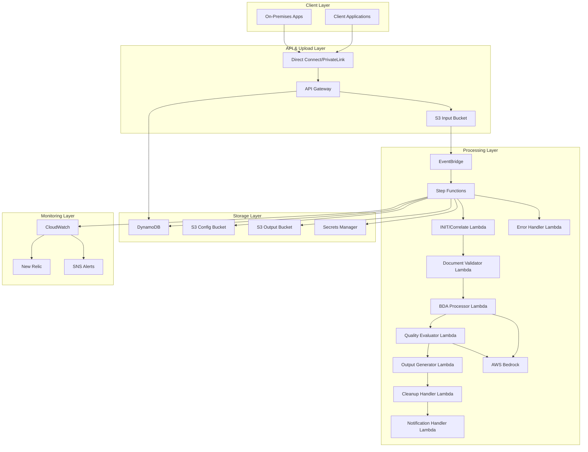
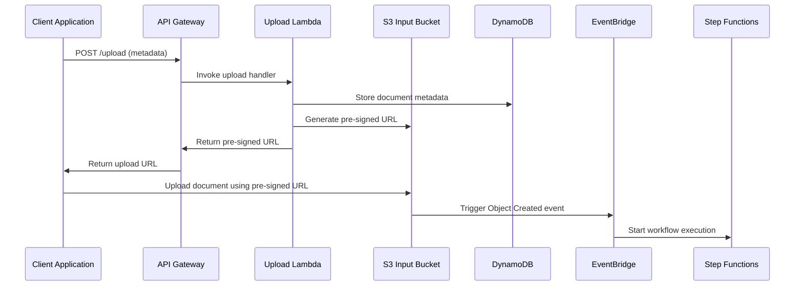
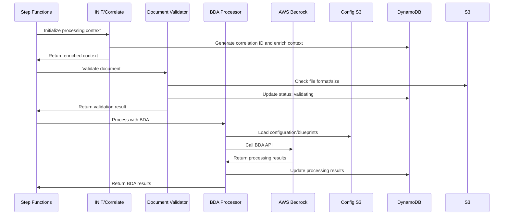
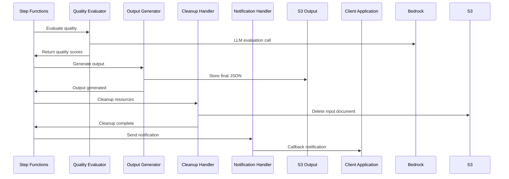
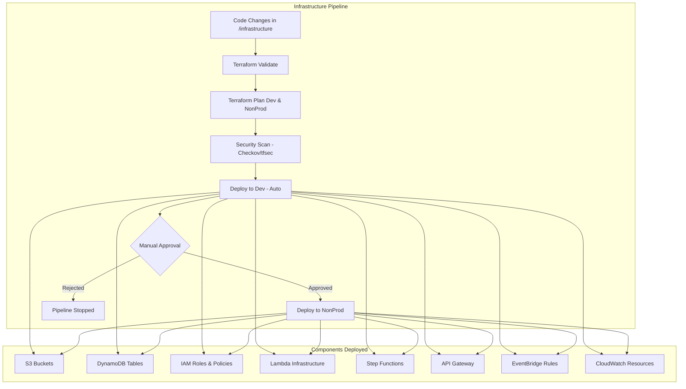
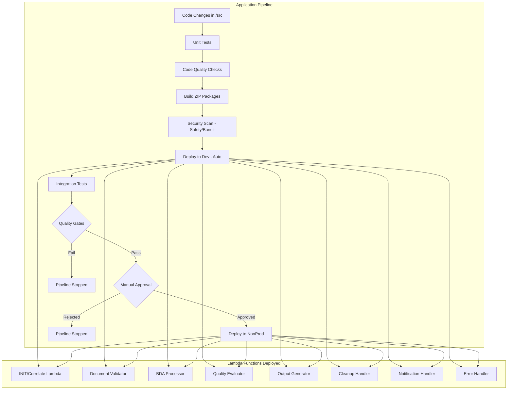
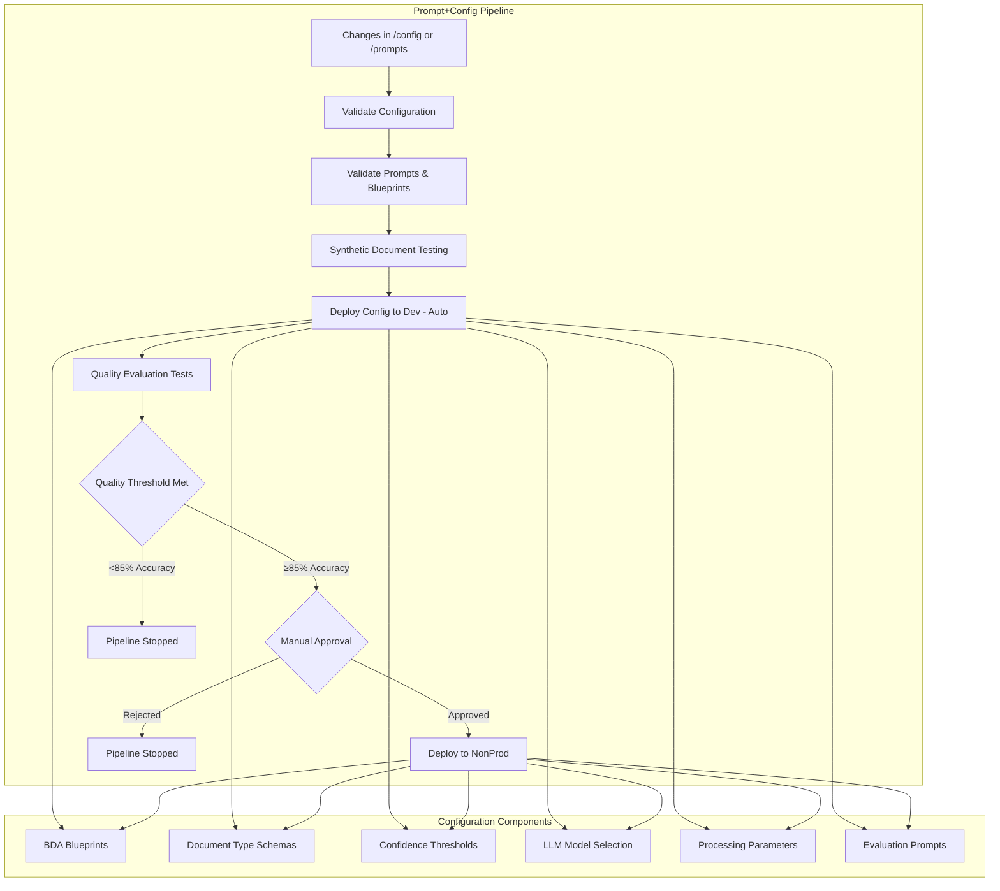

# Intelligent Document Processing (IDP) – Low Level Design (LLD)
## Use Case 3 – Evoke

---

## 1. Introduction

The Intelligent Document Processing (IDP) system automates classification, language detection, and extraction of structured fields from documents using AWS Bedrock Data Automation (BDA) and a fully serverless architecture.

All development and testing are done using synthetic (non PII) documents, ensuring compliance and safety.

Prompts, extraction rules, confidence thresholds, and model selections are configurable, stored in S3, and updated via CI/CD — allowing continuous improvements without redeploying code.

This LLD describes the complete technical implementation, infrastructure design, configuration strategy, prompt testing workflow, and promotion model across environments.

### Business Benefits

- **Improved Accuracy**: Target >95% classification accuracy and >90% field extraction accuracy
- **Reduced Manual Intervention**: Decrease manual review cases from 50% to <15%
- **Cost Optimization**: Serverless architecture reduces operational costs by 40-60%
- **Scalability**: Automatic scaling to handle 100-500 documents per minute
- **Extensibility**: Easy addition of new document types without code changes

---

## 2. High-Level Architecture Overview

The IDP solution is built entirely on AWS serverless components, with no VPC required.

### Runtime Architecture Components:
- **API Gateway** – creates pre-signed URLs for document upload
- **Amazon S3** (Input, Output, Config, Prompts)
- **EventBridge** – triggers workflow
- **Step Functions** – main orchestration of all steps
- **Lambda Functions** – validation, BDA calls, post-processing, callbacks
- **Bedrock Data Automation (BDA)** – classification, extraction, OCR
- **DynamoDB** – job tracking
- **SQS (DLQ)** – failure handling
- **CloudWatch + New Relic** – logs, metrics, monitoring

### Prompt Lab (Experimental Environment)
Used strictly for:
- Prompt design
- Testing
- Evaluation
- Synthetic dataset experimentation

### High-Level System Architecture



---

## 3. Environments

| Environment | Purpose |
|-------------|---------|
| Experimental Platform | Prompt testing, BDA experimentation, synthetic data evaluation |
| DEV | Developer testing using synthetic data - Auto deployment |
| Non-Prod | Production-like testing environment - Manual approval required |

### Environment Promotion Strategy
```
Experimental → DEV (Auto) → NonProd (Manual Approval)
```

---## 4. En
d-to-End Processing Flow (Runtime)

### Step 1 — Upload Initiation
1. Client calls `POST /idp/upload/initiate` via API Gateway.
2. Lambda generates: 
   - jobId
   - pre-signed S3 upload URL
3. Metadata stored in DynamoDB.

### Step 2 — Document Upload
4. Client uploads document using pre-signed URL → S3 Input bucket.
5. EventBridge detects the new object and triggers Step Functions.

### Step 3 — Workflow Orchestration
6. Step Functions loads:
   - Document-type config from S3 Config
   - Prompt file from S3 Prompts
7. Workflow steps:
   - Validate file (size, extension, path correctness)
   - Preprocessing / OCR (if required)
   - Call BDA for classification + extraction
   - Validate confidence thresholds
   - Format result JSON
   - Store result in S3 Output
   - Update DynamoDB status

### Step 4 — Callback
8. Callback Lambda notifies client with: 
   - jobStatus
   - output location
   - confidence scores
   - document type

### Step 5 — Logging & Monitoring
9. CloudWatch stores logs.
10. New Relic dashboards monitor: 
    - Failures
    - Latency
    - Drift in model quality
    - DLQ depth

### Document Upload Flow


### BDA Processing Flow


### Quality Evaluation and Output Flow


---#
# 5. Component-Level LLD

### Key Design Principles
- **Event-Driven Architecture**: Leverages AWS EventBridge for loose coupling and scalability
- **Serverless-First**: Uses Lambda functions and Step Functions for cost optimization
- **Configuration-Driven**: Supports dynamic parameter changes without code deployment
- **Security by Design**: Implements comprehensive security controls and data protection
- **Observability**: Built-in monitoring, logging, and alerting capabilities

### 5.1 S3 Buckets

#### Input Bucket
Used for document uploads.

**Structure:**
```
idp-input/<tenant>/<country>/<doctype>/<uuid>.<ext>
```

#### Output Bucket
Stores structured extraction results.
```
idp-output/<tenant>/<jobId>/result.json
```

#### Config Bucket
Stores JSON configs for each document type:
- fields
- thresholds
- model selection
- blueprint IDs
- language hints

#### Prompts Bucket
Stores prompt files for BDA:
- `/prompts/<doctype>/system.txt`
- optional few shot examples

### 5.2 DynamoDB Table

**Table:** `idp_jobs`

| Attribute | Description |
|-----------|-------------|
| jobId | Primary key |
| correlation_id | Correlation identifier for tracing |
| tenant, country | Routing info |
| status | RECEIVED / PROCESSING / COMPLETED / FAILED |
| docType | Detected or configured type |
| language | Detected language |
| confidence | extraction + classification scores |
| s3InputKey, s3OutputKey | File references |
| configVersion | Version used during execution |
| timestamps | Start/End/Callback times |
| enriched_context | Client configuration and routing rules |

### 5.3 Lambda Functions

The system uses **8 Lambda functions** orchestrated by AWS Step Functions:

#### 1. INIT/Correlate Lambda
- **Function Name**: `idp-init-correlate-{environment}`
- **Purpose**: Initializes processing context and generates correlation IDs
- **Runtime**: Python 3.11, 256 MB, 30s timeout
- **Key Operations**:
  - Generate correlation ID for tracing
  - Load client configuration
  - Validate IAM access
  - Enrich context with routing rules

#### 2. Upload Init Lambda
- **Function Name**: `idp-upload-init-{environment}`
- **Purpose**: Handle document upload initiation
- **Operations**:
  - Validate request
  - Generate pre-signed URL
  - Store metadata in DynamoDB

#### 3. Document Validator Lambda
- **Function Name**: `idp-document-validator-{environment}`
- **Purpose**: Validates uploaded documents
- **Runtime**: Python 3.11, 256 MB, 60s timeout
- **Validation Checks**:
  - File Format: PDF, JPG, JPEG, TIFF only
  - File Size: Maximum 10MB
  - File Accessibility: S3 object exists and readable

#### 4. BDA Processor Lambda (Orchestrator Lambda)
- **Function Name**: `idp-bda-processor-{environment}`
- **Purpose**: Handles Bedrock Data Automation processing
- **Runtime**: Python 3.11, 1024 MB, 300s timeout
- **Operations**:
  - Load config & prompt
  - Call Bedrock BDA
  - Validate response
  - Format output

#### 5. Quality Evaluator Lambda
- **Function Name**: `idp-quality-evaluator-{environment}`
- **Purpose**: LLM-based quality assessment
- **Runtime**: Python 3.11, 512 MB, 180s timeout

#### 6. Output Generator Lambda
- **Function Name**: `idp-output-generator-{environment}`
- **Purpose**: Creates structured JSON output
- **Runtime**: Python 3.11, 256 MB, 60s timeout

#### 7. Cleanup Handler Lambda
- **Function Name**: `idp-cleanup-handler-{environment}`
- **Purpose**: Manages document lifecycle
- **Runtime**: Python 3.11, 256 MB, 60s timeout

#### 8. Notification Handler Lambda (Callback Lambda)
- **Function Name**: `idp-notification-handler-{environment}`
- **Purpose**: Send notifications to clients
- **Runtime**: Python 3.11, 256 MB, 30s timeout
- **Operations**:
  - Send callback HTTP POST
  - Retry on failure

#### Error Manager Lambda
- **Function Name**: `idp-error-handler-{environment}`
- **Purpose**: Process errors and manage retry logic
- **Operations**:
  - Read from SQS DLQ
  - Log, alert, and flag issues

### 5.4 Step Functions Orchestration

**Purpose**: Orchestrate document processing pipeline with comprehensive error handling and monitoring

#### Step Functions Workflow States

**Processing Flow**:
1. **INIT/Correlate** - Initialize processing context and generate correlation IDs
2. **Document Validation** - Verify file format, size, and accessibility
3. **BDA Processing** - Single call to Bedrock Data Automation for complete document processing
4. **Confidence Check** - Evaluate if results meet quality thresholds
5. **Quality Evaluation** - LLM-based assessment of extraction accuracy
6. **Output Generation** - Create structured JSON output
7. **Resource Cleanup** - Remove temporary files and update status
8. **Notification** - Inform client application of completion

#### Error Handling:
- **Automatic Retry** - 3 attempts with exponential backoff for transient failures
- **Manual Review Queue** - Low confidence results routed for human review
- **Dead Letter Queue** - Failed processing items for investigation
- **Error Notifications** - Client applications notified of processing failures

#### Quality Gates:
- **Confidence Threshold** - Minimum 85% confidence for automatic processing
- **Format Validation** - Only PDF, JPG, JPEG, TIFF files accepted
- **Size Limits** - Maximum 10MB file size
- **Processing Timeout** - 5-minute maximum processing time

---### 5.5 Do
cument Processing Engine

**Purpose**: Core component for document classification and extraction

#### Sub-Components:

##### 5.5.1 Language Detection Service
- **Technology**: Bedrock Data Automation with language detection blueprints
- **Input**: Raw document uploaded to S3
- **Output**: Language code with confidence score via BDA
- **Threshold**: Minimum 95% confidence for language detection

##### 5.5.2 Document Classification Service
- **Technology**: Bedrock Data Automation with classification blueprints
- **Input**: Document and detected language from BDA
- **Output**: Document type classification with confidence score
- **Supported Types**: ID, POA, SOF, PH/ID, MFT, Legal Claims

**Supported Document Types**:
- **ID Documents**: National ID, Driver's License, Passport, Residence Permit, Citizenship Card, Yoti Card, Electoral Identity Card
- **Proof of Address**: Utility bills, Bank Statements, Lease agreements, Council tax bills, Payslips, Mortgage statements
- **Source of Funds**: Payslips, Bank Statements, Tax Declarations
- **Legal Claims**: Court documents across UK, Malta, Sweden, Spain, Germany jurisdictions

##### 5.5.3 Field Extraction Service
- **Technology**: Bedrock Data Automation with extraction blueprints and schemas
- **Input**: Classified document and extraction schema
- **Output**: Structured JSON with extracted fields and confidence scores
- **Schema Management**: BDA blueprints contain predefined schemas for each document type

---

## 6. Configuration Strategy

**Purpose**: Dynamic configuration for document processing parameters

### Configuration Structure:
```json
{
  "document_types": {
    "national_id": {
      "classification_threshold": 0.85,
      "extraction_schema": {
        "required_fields": ["full_name", "document_number", "expiry_date"],
        "optional_fields": ["address", "date_of_birth"]
      },
      "llm_model": "anthropic.claude-3-sonnet-20240229-v1:0",
      "language_hints": ["en", "de", "fr"],
      "complexity_level": "medium"
    }
  },
  "global_settings": {
    "max_processing_time": 300,
    "retry_attempts": 3,
    "output_format": "json"
  }
}
```

### Configuration Deployment:
- **Stored in S3** with versioning enabled
- **Lambda function** validates configuration changes
- **Automatic rollback** on validation failures
- **Configuration change** triggers pipeline deployment

### Config JSON Structure
- doctype
- required fields
- optional fields
- confidence thresholds
- blueprint name
- LLM model ID
- language hints
- post-processing rules

### Version Control
- **Source of truth** stored in GitLab
- **CI/CD** promotes to S3
- Each config has **semantic version + checksum**
- **Runtime logs** record configVersion

---

## 7. Prompt Testing & Management (Experimental Environment)

### Prompt Testing Cycle
1. **SME designs prompts** in Prompt Lab
2. **Developer loads** synthetic datasets
3. **BDA prompt tests** run manually or via Jupyter/SDK
4. **Evaluate**:
   - accuracy
   - extraction quality
   - hallucination risk
   - confidence calibration
   - multilingual performance
5. **SME reviews** results
6. **Iterate** until metrics meet thresholds

### Assets Produced
- system prompt
- few shot examples
- extraction schema
- evaluation report
- version number

### Promotion
- **Commit** prompt + config to GitLab
- **CI/CD** validates & pushes to S3 Config & S3 Prompts

---##
 8. Pipeline Architecture Overview

The CI/CD strategy implements three separate pipelines to enable independent deployment cycles and reduce blast radius of changes:

1. **Infrastructure Pipeline** - Manages AWS resources and networking
2. **Application Pipeline** - Handles Lambda functions and application code
3. **Prompt+Config Pipeline** - Manages BDA blueprints and configuration

### Pipeline 1: Infrastructure Pipeline

**Purpose**: Deploy and manage AWS infrastructure using Terraform

**Trigger Conditions**:
- Changes to `infrastructure/` directory
- Changes to `*.tf` files
- Manual pipeline execution
- Scheduled weekly validation runs



**GitLab stages:**
```yaml
stages:
  - validate
  - plan
  - security-scan
  - deploy-dev
  - deploy-nonprod
```

**Infrastructure Components Managed**:
- API Gateway with security policies and rate limiting
- Lambda functions with appropriate IAM roles
- S3 buckets with versioning and encryption
- DynamoDB tables with backup configuration
- IAM roles and policies with least privilege
- EventBridge rules and targets
- Step Functions state machines
- CloudWatch log groups and alarms
- New Relic integration resources
- Secrets Manager for secure credential storage

### Pipeline 2: Application Pipeline

**Purpose**: Build, test, and deploy Lambda function code using ZIP packages

**Trigger Conditions**:
- Changes to `src/` directory
- Changes to `requirements.txt` or `package.json`
- Manual pipeline execution



**Stages:**
```yaml
stages:
  - test
  - build
  - security-scan
  - deploy-dev
  - integration-test
  - deploy-nonprod
```

### Pipeline 3: Prompt+Config Pipeline

**Purpose**: Manage BDA blueprints, prompts, and system configuration

**Trigger Conditions**:
- Changes to `config/` directory
- Changes to `prompts/` directory
- Changes to `blueprints/` directory
- Manual pipeline execution



**Stages:**
```yaml
stages:
  - validate
  - test-synthetic
  - deploy-dev
  - evaluate-quality
  - deploy-nonprod
```

---#
# 9. Testing Strategy

### 1. Unit Testing

**Scope**: Individual Lambda functions and utility modules

**Framework**: pytest with mocking for AWS services

**Coverage Requirements**: Minimum 80% code coverage

**Test Categories**:
- Function input/output validation
- Error handling scenarios
- Configuration parsing logic
- Data transformation functions

### 2. Integration Testing

**Scope**: End-to-end workflow testing with AWS services

**Test Environment**: Dedicated dev environment with synthetic data

**Test Scenarios**:
- Document upload and BDA processing workflow
- Configuration change propagation to BDA blueprints
- Error handling and retry mechanisms
- Performance under load with BDA API calls

### 3. Synthetic Data Testing

**Purpose**: Validate processing accuracy with controlled test data

**Test Data Generation**:
- Programmatically generated documents for each type
- Multiple languages and layouts
- Edge cases and boundary conditions

**Validation Criteria**:
- Classification accuracy ≥ 95%
- Field extraction accuracy ≥ 90%
- Processing time ≤ 30 seconds per document

### 4. LLM Evaluation Testing

**Purpose**: Automated quality assessment using LLM-based evaluation

**Evaluation Process**:
1. Process synthetic documents through pipeline
2. Compare results against ground truth using LLM evaluator
3. Generate quality scores and detailed reports
4. Flag discrepancies for manual review

**Quality Thresholds**:
- Overall quality score ≥ 0.85
- Classification accuracy ≥ 0.95
- Field-level precision ≥ 0.90
- Field-level recall ≥ 0.85

### 5. Performance Testing

**Load Testing**:
- Concurrent document processing: 100 documents/minute
- Peak load handling: 500 documents/minute for 10 minutes
- Memory usage monitoring for Lambda functions

**Stress Testing**:
- Large document processing (up to 10MB)
- Complex document layouts
- Multiple language processing

---

## 10. Security Considerations

### Data Protection

1. **Encryption**:
   - S3 buckets encrypted with KMS keys
   - DynamoDB encryption at rest
   - Lambda environment variables encrypted

2. **Access Control**:
   - IAM roles with least privilege principle
   - Resource-based policies for cross-service access
   - VPC endpoints for private service communication

3. **Data Lifecycle**:
   - Automatic document deletion after processing
   - Log retention policies (1 year for AWS, 30 days for application)
   - No PII data in logs or metrics

### Network Security

1. **Serverless Security**:
   - Lambda functions in AWS-managed secure environment
   - No custom VPC required for this use case
   - Service-to-service communication via AWS backbone

2. **API Security**:
   - API Gateway with API keys and rate limiting
   - HTTPS enforcement for all endpoints
   - CORS configuration for web clients
   - AWS WAF for additional protection (optional)

3. **Service Integration Security**:
   - IAM roles for service-to-service authentication
   - Resource-based policies for fine-grained access
   - AWS PrivateLink for on-premises connectivity (if needed)

---

## 11. Data Models and Storage

### Document Metadata Model
```json
{
  "document_id": "uuid",
  "correlation_id": "correlation-uuid",
  "upload_timestamp": "iso8601",
  "client_id": "string",
  "document_type": "string",
  "file_format": "pdf|jpg|jpeg|tiff",
  "file_size_bytes": "integer",
  "callback_url": "string",
  "processing_status": "uploaded|processing|completed|failed|manual_review",
  "language_detected": "string",
  "language_confidence": "float",
  "classification_result": {
    "document_type": "string",
    "confidence_score": "float",
    "classification_timestamp": "iso8601"
  },
  "extraction_result": {
    "extracted_fields": "object",
    "confidence_scores": "object",
    "extraction_timestamp": "iso8601"
  },
  "evaluation_result": {
    "quality_score": "float",
    "accuracy_metrics": "object",
    "evaluation_timestamp": "iso8601"
  },
  "enriched_context": {
    "client_config": "object",
    "routing_rules": "object"
  }
}
```

### Processing Result Output
```json
{
  "document_id": "uuid",
  "processing_metadata": {
    "processed_at": "iso8601",
    "processing_duration_total_ms": "integer",
    "system_version": "string"
  },
  "document_classification": {
    "type": "string",
    "confidence": "float",
    "language": "string"
  },
  "extracted_data": {
    "field_name": "field_value"
  },
  "confidence_scores": {
    "field_name": "confidence_float"
  },
  "quality_assessment": {
    "overall_score": "float",
    "meets_threshold": "boolean",
    "manual_review_required": "boolean"
  }
}
```

---

## 12. Error Handling and Resilience

### Error Categories and Responses

**Upload Errors**
- Invalid file format: Return 400 with supported formats list
- File size exceeded: Return 413 with size limits
- Authentication failure: Return 401 with error details

**Processing Errors**
- BDA API failure: Automatic retry with exponential backoff
- Classification below threshold: Route to manual review queue
- Processing timeout: Increase timeout and retry once
- Configuration error: Use fallback configuration and alert administrators

**Resilience Patterns**
- **Circuit Breaker**: 50% failure rate triggers circuit open for 2 minutes
- **Retry Logic**: 3 attempts with exponential backoff for transient failures
- **Dead Letter Queue**: Failed items after max retries for investigation
- **Health Checks**: Synthetic document processing tests for system validation

---

## 13. Monitoring and Observability

### Monitoring Strategy
- **CloudWatch Integration**: Native AWS monitoring for all services
- **New Relic Integration**: Advanced observability and performance monitoring
- **Custom Metrics**: Business-specific metrics for document processing
- **Real-time Dashboards**: Processing status, quality metrics, and error analysis

### Alerting Configuration
- **Critical Alerts**: Processing failure rate >5%, DLQ messages >0
- **Warning Alerts**: Manual review queue depth >10, processing time >60s
- **Business Metrics**: Classification accuracy drops, throughput anomalies
- **Notification Channels**: Email, Slack, and SMS for different severity levels

### Performance Targets
- **Processing Time**: ≤30 seconds per document (average)
- **Throughput**: 100 documents/minute (normal), 500 documents/minute (peak)
- **Availability**: 99.9% uptime with automatic failover
- **Accuracy**: ≥95% classification, ≥90% field extraction

---

## 14. Service Integration Details

### BDA Integration Architecture

**BDA Blueprint Structure**:
- **Document Types**: National ID, Driver's License, Passport, Utility Bills, Bank Statements, Legal Claims
- **Processing Models**: Claude Sonnet for classification/extraction, Haiku for evaluation
- **Configuration Management**: Dynamic blueprint loading from S3
- **Quality Thresholds**: Configurable confidence scores per document type

**BDA API Call Flow**:
1. **Input Preparation**: Document uploaded to S3, metadata in DynamoDB
2. **Configuration Loading**: Load blueprint from S3 configuration bucket
3. **BDA Invocation**: Single API call with document reference and blueprint
4. **Result Processing**: Parse classification, extraction, and confidence scores
5. **Quality Check**: Validate results against thresholds
6. **Output Generation**: Format results for downstream consumption

---

This comprehensive Low Level Design provides a complete technical specification for implementing a robust, scalable, and secure Intelligent Document Processing system using AWS serverless architecture with proper CI/CD practices and comprehensive testing strategies.